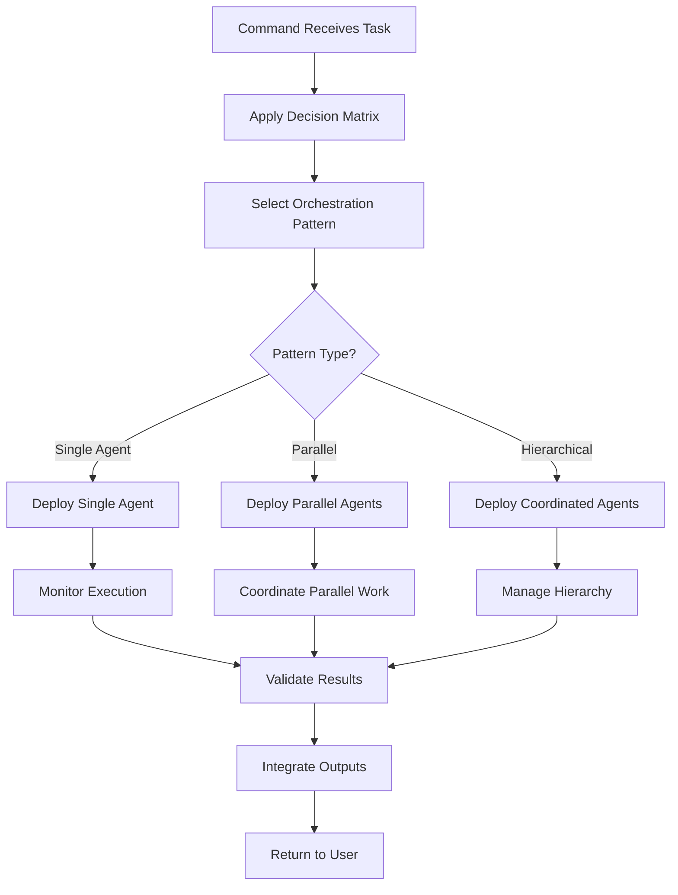

[Previous: Study decision matrices](decision-matrix-specifications.md) | [Return to Documentation Hub for navigation](../index.md) | [Study PRINCIPLES.md for framework](../PRINCIPLES.md) | [Next: Apply consolidation architecture](command-consolidation-architecture.md)

# AGENT ORCHESTRATION FRAMEWORK

⏺ **Principle**: This framework implements [task-orchestration.md coordination methodology](../principles/task-orchestration.md) within [command-consolidation-architecture.md](command-consolidation-architecture.md) to create seamless agent coordination patterns for command execution.

## Table of Contents
- [Orchestration Architecture](#orchestration-architecture)
- [Coordination Patterns](#coordination-patterns)
- [Command Integration Methods](#command-integration-methods)
- [Agent Lifecycle Management](#agent-lifecycle-management)
- [Communication Protocols](#communication-protocols)
- [Quality Assurance Framework](#quality-assurance-framework)
- [Performance Optimization](#performance-optimization)
- [Error Handling and Recovery](#error-handling-and-recovery)
- [Monitoring and Validation](#monitoring-and-validation)
- [Cross-References](#cross-references)

## Orchestration Architecture

⏺ **Principle**: This architecture implements [command-consolidation-architecture.md](command-consolidation-architecture.md) by establishing commands as the primary orchestration controllers for all agent deployments.

### Core Orchestration Principles
1. **Command-Centric Control**: Commands serve as orchestration hubs
2. **Agent Specialization**: Each agent operates within defined expertise boundaries
3. **Quality Assurance**: Continuous validation throughout execution
4. **Context Preservation**: Main instance maintains user communication
5. **Systematic Coordination**: Predictable, repeatable orchestration patterns

### Orchestration Layers
```
┌─────────────────────────────────────────────────────────────┐
│                  COMMAND ORCHESTRATION LAYER                │
│  ┌─────────────┐  ┌─────────────┐  ┌─────────────────────┐ │
│  │ TASK        │  │ AGENT       │  │    QUALITY          │ │
│  │ ANALYSIS    │◄─┤COORDINATION │─►│ ORCHESTRATION       │ │
│  │ & PLANNING  │  │ ENGINE      │  │ & VALIDATION        │ │
│  └─────────────┘  └─────┬───────┘  └─────────────────────┘ │
└────────────────────────┼─────────────────────────────────────┘
                         │
┌────────────────────────▼─────────────────────────────────────┐
│               AGENT COORDINATION LAYER                      │
│  ┌─────────────┐  ┌─────────────┐  ┌─────────────────────┐ │
│  │  SINGLE     │  │ PARALLEL    │  │   HIERARCHICAL      │ │
│  │ AGENT       │  │ AGENT       │  │    AGENT            │ │
│  │DEPLOYMENT   │  │COORDINATION │  │  COORDINATION       │ │
│  └─────────────┘  └─────────────┘  └─────────────────────┘ │
└────────────────────────┬─────────────────────────────────────┘
                         │
┌────────────────────────▼─────────────────────────────────────┐
│                AGENT EXECUTION LAYER                        │
│          Individual Agent Instances + Task Tools            │
└─────────────────────────────────────────────────────────────┘
```

### Orchestration Control Flow


## Coordination Patterns

⏺ **Principle**: These patterns implement [decision-matrix-specifications.md](decision-matrix-specifications.md) through systematic coordination methodologies for different task complexities.

### Pattern 1: Single Agent Deployment
**Usage**: Straightforward tasks with clear agent capability match

```markdown
## Single Agent Orchestration
### Pattern Structure
- **Command Role**: Task preparation and result validation
- **Agent Role**: Complete task execution within specialty
- **Coordination**: Direct task handoff with success criteria
- **Quality Control**: Command validates against defined criteria

### Implementation Flow
```bash
# Single Agent Deployment Pattern
single_agent_orchestration() {
    # Phase 1: Task Preparation
    task_specification = prepare_task_context()
    success_criteria = define_validation_requirements()
    selected_agent = apply_agent_selection_matrix()
    
    # Phase 2: Agent Deployment
    agent_result = deploy_agent(
        agent=selected_agent,
        task=task_specification,
        criteria=success_criteria,
        context=command_context
    )
    
    # Phase 3: Result Validation
    validation_result = validate_agent_output(agent_result, success_criteria)
    if (!validation_result.passes) {
        return execute_improvement_cycle(agent_result, validation_result.gaps)
    }
    
    # Phase 4: Integration
    return integrate_result_with_command_context(agent_result)
}
```

### Quality Gates
- **Pre-deployment**: Agent capability verification
- **During execution**: Progress monitoring (if applicable)
- **Post-execution**: Success criteria validation
- **Integration**: Context compatibility verification
```

### Pattern 2: Parallel Agent Coordination
**Usage**: Independent tasks that can execute simultaneously

```markdown
## Parallel Agent Orchestration
### Pattern Structure
- **Command Role**: Coordination hub and result integration
- **Agent Roles**: Independent task execution within specialties
- **Coordination**: Parallel deployment with synchronized completion
- **Quality Control**: Individual validation + integration validation

### Implementation Flow
```bash
# Parallel Agent Coordination Pattern
parallel_agent_orchestration() {
    # Phase 1: Task Decomposition
    task_components = decompose_task_into_parallel_components()
    agent_assignments = assign_agents_to_components(task_components)
    
    # Phase 2: Parallel Deployment
    parallel_results = []
    for assignment in agent_assignments {
        agent_task = prepare_component_task(assignment.component)
        result = deploy_agent_async(
            agent=assignment.agent,
            task=agent_task,
            completion_callback=handle_agent_completion
        )
        parallel_results.append(result)
    }
    
    # Phase 3: Synchronization
    wait_for_all_agents_completion(parallel_results)
    
    # Phase 4: Result Integration
    integrated_result = integrate_parallel_results(parallel_results)
    validation_result = validate_integrated_output(integrated_result)
    
    return finalize_parallel_execution(integrated_result, validation_result)
}
```

### Coordination Challenges
- **Dependency Management**: Ensure truly independent tasks
- **Resource Conflicts**: Prevent agent conflicts over shared resources
- **Timing Coordination**: Synchronize completion for integration
- **Quality Assurance**: Validate both individual and integrated results
```

### Pattern 3: Hierarchical Agent Coordination
**Usage**: Complex tasks requiring primary coordination with specialist support

```markdown
## Hierarchical Agent Orchestration
### Pattern Structure
- **Command Role**: High-level coordination and final validation
- **Primary Agent**: Task coordination and sub-agent management
- **Secondary Agents**: Specialized execution within primary agent direction
- **Quality Control**: Multi-level validation with escalation protocols

### Implementation Flow
```bash
# Hierarchical Agent Coordination Pattern
hierarchical_agent_orchestration() {
    # Phase 1: Primary Agent Selection
    primary_agent = select_coordinating_agent(task_requirements)
    coordination_strategy = define_coordination_approach()
    
    # Phase 2: Primary Agent Deployment
    primary_agent_result = deploy_primary_agent(
        agent=primary_agent,
        task=task_specification,
        coordination_authority=coordination_strategy,
        sub_agent_catalog=available_agents
    )
    
    # Phase 3: Sub-Agent Coordination (managed by primary agent)
    # Primary agent handles:
    # - Sub-agent selection and deployment
    # - Work coordination and integration
    # - Quality assurance and validation
    
    # Phase 4: Command-Level Validation
    command_validation = validate_hierarchical_result(primary_agent_result)
    if (!command_validation.passes) {
        return escalate_quality_issues(primary_agent_result, command_validation)
    }
    
    return finalize_hierarchical_execution(primary_agent_result)
}
```

### Coordination Hierarchy
- **Level 1**: Command (overall coordination and final validation)
- **Level 2**: Primary Agent (task coordination and sub-agent management)
- **Level 3**: Specialist Agents (focused execution within expertise)
- **Level 4**: Task Tools (atomic operations and data access)
```

### Pattern 4: Sequential Agent Pipeline
**Usage**: Tasks with clear dependency chains requiring sequential execution

```markdown
## Sequential Agent Pipeline Orchestration
### Pattern Structure
- **Command Role**: Pipeline design and overall coordination
- **Agent Roles**: Sequential execution with output handoff
- **Coordination**: Stage-by-stage progression with validation gates
- **Quality Control**: Stage validation + pipeline integrity verification

### Implementation Flow
```bash
# Sequential Agent Pipeline Pattern
sequential_pipeline_orchestration() {
    # Phase 1: Pipeline Design
    pipeline_stages = design_execution_pipeline(task_requirements)
    stage_dependencies = map_inter_stage_dependencies(pipeline_stages)
    
    # Phase 2: Sequential Execution
    pipeline_state = initialize_pipeline_state()
    
    for stage in pipeline_stages {
        # Prepare stage input from previous stage output
        stage_input = prepare_stage_input(pipeline_state, stage.dependencies)
        
        # Execute stage with assigned agent
        stage_result = deploy_agent(
            agent=stage.assigned_agent,
            task=stage.task_specification,
            input=stage_input,
            validation_criteria=stage.success_criteria
        )
        
        # Validate stage completion
        stage_validation = validate_stage_output(stage_result, stage.success_criteria)
        if (!stage_validation.passes) {
            return handle_pipeline_failure(stage, stage_validation, pipeline_state)
        }
        
        # Update pipeline state
        pipeline_state = update_pipeline_state(pipeline_state, stage_result)
    }
    
    # Phase 3: Pipeline Completion
    final_result = extract_pipeline_result(pipeline_state)
    return validate_pipeline_completion(final_result)
}
```

### Pipeline Management
- **Stage Isolation**: Each stage operates independently
- **State Management**: Pipeline state carries context between stages
- **Failure Recovery**: Stage failure handling with recovery options
- **Quality Gates**: Validation at each stage transition
```

## Command Integration Methods

⏺ **Principle**: These methods implement [command-enhancement-patterns.md](command-enhancement-patterns.md) by providing systematic approaches for integrating orchestration into command structures.

### Method 1: Embedded Orchestration
**Usage**: Orchestration logic directly integrated into command execution

```markdown
## Embedded Orchestration Integration
### Command Structure Enhancement
```markdown
# Enhanced Command Template with Embedded Orchestration

## Agent Orchestration Section
### Orchestration Strategy
- **Pattern**: [Single|Parallel|Hierarchical|Sequential]
- **Primary Agent**: [Agent identification and rationale]
- **Coordination Requirements**: [Multi-agent coordination needs]
- **Quality Gates**: [Validation checkpoints and criteria]

## Execution Framework
### Phase 6: Implementation (Enhanced with Orchestration)
```bash
# Embedded orchestration within command execution
execute_command_with_orchestration() {
    # Standard workflow phases 1-5 (clarify, explore, analyze, present, plan)
    
    # Phase 6: Enhanced Implementation with Orchestration
    orchestration_pattern = determine_orchestration_pattern(planning_result)
    
    case orchestration_pattern {
        "single_agent":
            result = execute_single_agent_pattern(selected_agent, task_spec)
        "parallel_agents":
            result = execute_parallel_pattern(agent_assignments, coordination_protocol)
        "hierarchical_agents":
            result = execute_hierarchical_pattern(primary_agent, coordination_strategy)
        "sequential_pipeline":
            result = execute_pipeline_pattern(pipeline_stages, dependencies)
    }
    
    # Standard workflow phases 7-8 (ripple-effect, validate)
    return complete_command_execution(result)
}
```
```

### Method 2: Delegated Orchestration
**Usage**: Specialized orchestration agent manages complex coordination

```markdown
## Delegated Orchestration Integration
### Command Structure Enhancement
```markdown
# Command with Delegated Orchestration

## Agent Orchestration Section
### Orchestration Delegation
- **Orchestration Agent**: [Specialized coordination agent]
- **Delegation Criteria**: [Complex coordination requirements]
- **Oversight Requirements**: [Command-level monitoring needs]

## Execution Framework
### Phase 6: Implementation (Delegated Orchestration)
```bash
# Delegated orchestration pattern
execute_command_with_delegation() {
    # Standard workflow phases 1-5
    
    # Phase 6: Delegated Implementation
    if (requires_complex_orchestration(planning_result)) {
        orchestration_agent = select_orchestration_specialist()
        result = deploy_agent(
            agent=orchestration_agent,
            task=complex_coordination_task,
            resources=available_agents,
            oversight=command_monitoring_protocol
        )
    } else {
        result = execute_standard_orchestration(planning_result)
    }
    
    # Standard workflow phases 7-8
    return complete_command_execution(result)
}
```
```

### Method 3: Hybrid Orchestration
**Usage**: Combination of embedded and delegated orchestration based on complexity

```markdown
## Hybrid Orchestration Integration
### Dynamic Orchestration Selection
```bash
# Hybrid orchestration decision logic
execute_command_with_hybrid_orchestration() {
    orchestration_complexity = assess_orchestration_complexity(task_requirements)
    
    if (orchestration_complexity.level <= "moderate") {
        return execute_embedded_orchestration(task_requirements)
    } elif (orchestration_complexity.level == "high") {
        return execute_delegated_orchestration(task_requirements)
    } else {
        return execute_escalated_orchestration(task_requirements)
    }
}
```
```

## Agent Lifecycle Management

### Lifecycle Phases
1. **Selection**: Agent capability assessment and selection
2. **Preparation**: Context preparation and task specification
3. **Deployment**: Agent instantiation and task assignment
4. **Monitoring**: Execution progress tracking and intervention
5. **Validation**: Output quality assessment and criteria verification
6. **Integration**: Result incorporation into command context
7. **Cleanup**: Resource cleanup and state management

### Lifecycle Management Framework
```bash
# Agent Lifecycle Management
manage_agent_lifecycle(agent_specification, task_context) {
    # Phase 1: Selection
    selected_agent = apply_selection_criteria(agent_specification)
    
    # Phase 2: Preparation
    agent_context = prepare_agent_context(task_context, selected_agent)
    success_criteria = define_validation_requirements(task_context)
    
    # Phase 3: Deployment
    agent_instance = deploy_agent(selected_agent, agent_context, success_criteria)
    execution_monitor = establish_monitoring(agent_instance)
    
    # Phase 4: Monitoring
    while (agent_instance.executing) {
        execution_status = check_agent_status(agent_instance)
        if (execution_status.requires_intervention) {
            handle_execution_intervention(agent_instance, execution_status)
        }
        wait(monitoring_interval)
    }
    
    # Phase 5: Validation
    agent_result = retrieve_agent_result(agent_instance)
    validation_result = validate_agent_output(agent_result, success_criteria)
    
    # Phase 6: Integration
    if (validation_result.passes) {
        integrated_result = integrate_with_command_context(agent_result)
    } else {
        integrated_result = handle_validation_failure(agent_result, validation_result)
    }
    
    # Phase 7: Cleanup
    cleanup_agent_resources(agent_instance)
    log_agent_execution(agent_instance, validation_result)
    
    return integrated_result
}
```

## Communication Protocols

⏺ **Principle**: These protocols implement [communication.md imperative patterns](../principles/communication.md) for clear, efficient agent coordination and status management.

### Protocol 1: Command-Agent Communication
```bash
# Command-Agent Communication Protocol
command_agent_protocol = {
    # Task Assignment
    task_assignment: {
        format: "structured_specification",
        content: [
            "task_description",
            "success_criteria", 
            "context_information",
            "validation_requirements",
            "integration_expectations"
        ]
    },
    
    # Status Updates
    status_updates: {
        frequency: "milestone_based",
        content: [
            "progress_percentage",
            "current_phase",
            "encountered_issues",
            "estimated_completion",
            "quality_checkpoints"
        ]
    },
    
    # Result Delivery
    result_delivery: {
        format: "structured_output",
        content: [
            "primary_deliverable",
            "supporting_materials",
            "quality_evidence",
            "integration_guidance",
            "follow_up_recommendations"
        ]
    }
}
```

### Protocol 2: Inter-Agent Communication
```bash
# Inter-Agent Communication Protocol (for multi-agent coordination)
inter_agent_protocol = {
    # Coordination Messages
    coordination: {
        handoff_protocol: "structured_data_transfer",
        dependency_notification: "milestone_based_alerts",
        conflict_resolution: "escalation_to_command",
        resource_sharing: "request_approval_system"
    },
    
    # Synchronization
    synchronization: {
        checkpoint_alignment: "shared_milestone_system",
        progress_coordination: "regular_status_exchange",
        completion_notification: "immediate_broadcast"
    }
}
```

### Protocol 3: Command-User Communication
```bash
# Command-User Communication Protocol
command_user_protocol = {
    # Progress Reporting
    progress_reporting: {
        frequency: "phase_completion",
        detail_level: "executive_summary",
        format: "structured_update"
    },
    
    # Decision Points
    decision_points: {
        trigger: "significant_choice_required",
        presentation: "options_with_analysis",
        response_handling: "incorporate_into_execution"
    },
    
    # Result Presentation
    result_presentation: {
        format: "comprehensive_summary",
        validation_evidence: "included",
        actionable_recommendations: "prioritized_list"
    }
}
```

## Quality Assurance Framework

⏺ **Principle**: This framework implements [validation.md comprehensive methodology](../principles/validation.md) through systematic quality assurance integration across all orchestration patterns.

### Quality Assurance Levels

#### Level 1: Agent-Level Quality Assurance
```bash
# Individual Agent Quality Assurance
agent_level_qa() {
    # Pre-execution validation
    validate_agent_readiness(agent_specification, task_requirements)
    
    # Execution monitoring
    monitor_agent_performance(execution_metrics, quality_standards)
    
    # Output validation
    validate_agent_output(agent_result, success_criteria)
    
    # Quality certification
    certify_agent_result(validation_evidence, quality_assessment)
}
```

#### Level 2: Coordination-Level Quality Assurance
```bash
# Multi-Agent Coordination Quality Assurance
coordination_level_qa() {
    # Coordination integrity
    validate_coordination_protocol(agent_interactions, coordination_rules)
    
    # Integration validation
    validate_result_integration(multi_agent_outputs, integration_requirements)
    
    # Consistency verification
    verify_output_consistency(integrated_result, overall_objectives)
}
```

#### Level 3: Command-Level Quality Assurance
```bash
# Command-Level Quality Assurance
command_level_qa() {
    # Objective fulfillment
    validate_objective_achievement(command_result, original_requirements)
    
    # Quality standards compliance
    verify_quality_standards(command_result, framework_requirements)
    
    # User satisfaction validation
    validate_user_requirements(command_result, user_expectations)
}
```

### Quality Gate Framework
```bash
# Quality Gate System
quality_gate_system = {
    # Pre-Deployment Gates
    pre_deployment: [
        "agent_capability_verification",
        "task_specification_completeness",
        "success_criteria_definition",
        "context_preparation_adequacy"
    ],
    
    # Execution Gates
    execution: [
        "progress_milestone_validation",
        "quality_checkpoint_verification",
        "coordination_integrity_checks",
        "performance_standard_monitoring"
    ],
    
    # Post-Execution Gates
    post_execution: [
        "output_quality_validation",
        "success_criteria_verification",
        "integration_compatibility_check",
        "user_requirement_fulfillment"
    ]
}
```

## Performance Optimization

### Optimization Strategies

#### Strategy 1: Agent Selection Optimization
```bash
# Agent Selection Performance Optimization
optimize_agent_selection() {
    # Cache agent capability assessments
    capability_cache = maintain_agent_capability_cache()
    
    # Optimize selection algorithms
    selection_algorithm = use_optimized_matching_algorithm()
    
    # Parallel capability assessment
    if (multiple_agent_candidates) {
        assess_capabilities_in_parallel(agent_candidates)
    }
}
```

#### Strategy 2: Coordination Efficiency
```bash
# Coordination Performance Optimization
optimize_coordination() {
    # Minimize coordination overhead
    coordination_protocol = select_minimal_overhead_protocol()
    
    # Optimize communication patterns
    communication_strategy = use_efficient_communication_patterns()
    
    # Parallel execution where possible
    execution_plan = maximize_parallel_execution_opportunities()
}
```

#### Strategy 3: Resource Management
```bash
# Resource Management Optimization
optimize_resources() {
    # Agent resource pooling
    agent_pool = maintain_agent_resource_pool()
    
    # Optimal resource allocation
    resource_allocation = optimize_resource_distribution()
    
    # Resource cleanup and reuse
    implement_efficient_cleanup_and_reuse()
}
```

## Error Handling and Recovery

### Error Categories and Handling

#### Category 1: Agent Selection Errors
```bash
# Agent Selection Error Handling
handle_agent_selection_errors() {
    try {
        selected_agent = apply_agent_selection_matrix()
    } catch (NoSuitableAgentError) {
        return generate_agent_creation_ticket()
    } catch (AgentCapabilityMismatchError) {
        return retry_with_relaxed_criteria()
    } catch (AgentUnavailableError) {
        return queue_for_agent_availability()
    }
}
```

#### Category 2: Coordination Errors
```bash
# Coordination Error Handling
handle_coordination_errors() {
    try {
        coordination_result = execute_coordination_pattern()
    } catch (AgentCommunicationError) {
        return retry_with_alternative_protocol()
    } catch (SynchronizationError) {
        return reset_and_resynchronize_agents()
    } catch (IntegrationError) {
        return execute_manual_integration_recovery()
    }
}
```

#### Category 3: Quality Validation Errors
```bash
# Quality Validation Error Handling
handle_quality_errors() {
    try {
        validation_result = validate_orchestration_output()
    } catch (QualityStandardsViolation) {
        return execute_quality_improvement_cycle()
    } catch (RequirementsMismatch) {
        return clarify_requirements_and_retry()
    } catch (ValidationCriteriaError) {
        return refine_validation_criteria()
    }
}
```

### Recovery Strategies

#### Strategy 1: Graceful Degradation
```bash
# Graceful Degradation Recovery
graceful_degradation() {
    if (optimal_orchestration_fails()) {
        return attempt_simplified_orchestration()
    }
    
    if (multi_agent_coordination_fails()) {
        return fallback_to_single_agent()
    }
    
    if (specialized_agent_fails()) {
        return use_general_purpose_agent()
    }
}
```

#### Strategy 2: Incremental Recovery
```bash
# Incremental Recovery Strategy
incremental_recovery() {
    failure_point = identify_failure_point()
    
    if (failure_point == "early_stage") {
        return restart_from_beginning()
    } elif (failure_point == "middle_stage") {
        return restart_from_last_checkpoint()
    } else {
        return complete_with_manual_intervention()
    }
}
```

## Monitoring and Validation

### Monitoring Framework
```bash
# Comprehensive Monitoring Framework
orchestration_monitoring = {
    # Real-time Metrics
    real_time: [
        "agent_execution_progress",
        "coordination_efficiency",
        "quality_checkpoint_status",
        "resource_utilization",
        "error_rate_tracking"
    ],
    
    # Performance Metrics
    performance: [
        "execution_time_analysis",
        "throughput_measurement",
        "quality_score_tracking",
        "user_satisfaction_metrics",
        "cost_efficiency_analysis"
    ],
    
    # Quality Metrics
    quality: [
        "output_quality_scores",
        "requirement_fulfillment_rate",
        "validation_pass_rate",
        "error_recovery_success_rate",
        "continuous_improvement_indicators"
    ]
}
```

### Validation Integration
```bash
# Integrated Validation Framework
validation_integration() {
    # Continuous Validation
    setup_continuous_validation_monitoring()
    
    # Milestone Validation
    implement_milestone_validation_checkpoints()
    
    # Final Validation
    execute_comprehensive_final_validation()
    
    # Post-Completion Validation
    perform_post_completion_quality_assessment()
}
```

## Cross-References

### Primary Navigation
- [Return to Documentation Hub](../index.md)
- [Study consolidation architecture](command-consolidation-architecture.md)
- [Apply decision matrices](decision-matrix-specifications.md)

### Related Principles
- [Study task-orchestration.md for coordination methodology](../principles/task-orchestration.md)
- [Apply agent-selection.md for systematic deployment](../principles/agent-selection.md)
- [Use workflow.md for systematic execution](../principles/workflow.md)
- [Apply validation.md for quality assurance](../principles/validation.md)

### Related Architecture
- [Study command enhancement patterns](command-enhancement-patterns.md)
- [Apply communication protocols](../components/communication-protocols.md)
- [Use quality frameworks](../components/quality-frameworks.md)

### Implementation Resources
- [Browse existing agents](../../agents/)
- [Study command templates](../templates/enhanced-command-template.md)
- [Review workflow phases](../components/workflow-phases.md)

[⬆ Return to top](#agent-orchestration-framework)