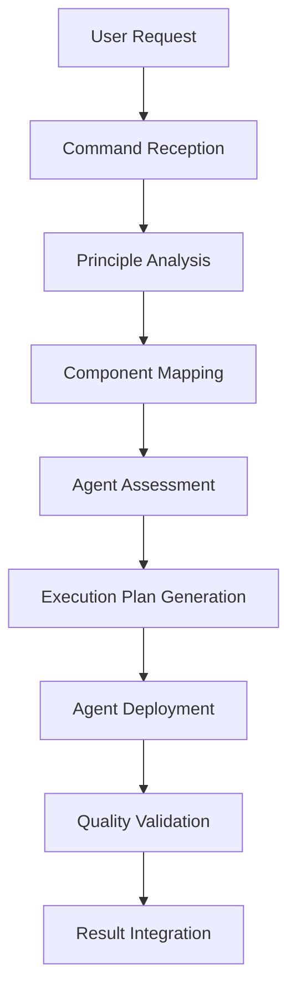

[Previous: Study PRINCIPLES.md for framework](../PRINCIPLES.md) | [Return to Documentation Hub for navigation](../index.md) | [Study command patterns](command-enhancement-patterns.md) | [Next: Apply agent orchestration](agent-orchestration-framework.md)

# COMMAND CONSOLIDATION ARCHITECTURE

⏺ **Principle**: This architecture implements [directive.md execution requirements](../principles/directive.md) by making commands the single consolidation layer where all framework elements converge into actionable execution plans.

## Table of Contents
- [Architecture Overview](#architecture-overview)
- [Consolidation Philosophy](#consolidation-philosophy)
- [Command Enhancement Framework](#command-enhancement-framework)
- [Integration Methodology](#integration-methodology)
- [Agent Orchestration Architecture](#agent-orchestration-architecture)
- [Decision Framework](#decision-framework)
- [Implementation Specifications](#implementation-specifications)
- [Validation Protocols](#validation-protocols)
- [Cross-References](#cross-references)

## Architecture Overview

### Core Concept
Commands serve as the **SINGLE POINT OF CONVERGENCE** where:
- **Principles** (philosophical foundation) integrate with
- **Components** (implementation patterns) to create
- **Executable Instructions** (actionable execution plans)

### Architectural Layers
```
┌─────────────────────────────────────────────────────────────┐
│                    USER REQUEST                              │
└─────────────────────┬───────────────────────────────────────┘
                      │
┌─────────────────────▼───────────────────────────────────────┐
│              COMMAND CONSOLIDATION LAYER                    │
│  ┌─────────────┐  ┌─────────────┐  ┌─────────────────────┐ │
│  │ PRINCIPLES  │◄─┤   COMMAND   ├─►│    COMPONENTS       │ │
│  │Philosophy   │  │Consolidator │  │Implementation       │ │
│  │Framework    │  │   Engine    │  │Patterns             │ │
│  └─────────────┘  └─────┬───────┘  └─────────────────────┘ │
└────────────────────────┼─────────────────────────────────────┘
                         │
┌────────────────────────▼─────────────────────────────────────┐
│              AGENT ORCHESTRATION LAYER                      │
│  ┌─────────────┐  ┌─────────────┐  ┌─────────────────────┐ │
│  │   AGENT     │  │   AGENT     │  │    EXECUTION        │ │
│  │ SELECTION   │  │COORDINATION │  │   MONITORING        │ │
│  │  MATRIX     │  │  PROTOCOLS  │  │   & VALIDATION      │ │
│  └─────────────┘  └─────────────┘  └─────────────────────┘ │
└────────────────────────┬─────────────────────────────────────┘
                         │
┌────────────────────────▼─────────────────────────────────────┐
│                EXECUTION LAYER                               │
│          Specialized Agents + Task Orchestration            │
└─────────────────────────────────────────────────────────────┘
```

## Consolidation Philosophy

⏺ **Principle**: This philosophy implements [workflow.md systematic execution](../principles/workflow.md) by establishing commands as the materialization point for all conceptual framework elements.

### Core Tenets
1. **Single Source of Truth**: Commands are the definitive instruction set
2. **Principle Materialization**: Abstract principles become concrete actions
3. **Component Integration**: Implementation patterns merge seamlessly
4. **Agent Orchestration**: Systematic deployment of specialized capabilities
5. **Execution Traceability**: Every action traces back to principle foundation

### Consolidation Process


## Command Enhancement Framework

### Enhanced Command Structure
Every command now follows this consolidation pattern:

```markdown
## Principle Integration Section
⏺ **Consolidation**: This command materializes [specific principles] through [specific components] into [specific execution patterns]

## Component Mapping Section
- **Workflow Components**: [Which workflow phases apply]
- **Technical Components**: [Which implementation patterns apply]
- **Quality Components**: [Which validation patterns apply]

## Agent Orchestration Section
- **Primary Agent**: [Main agent for execution]
- **Supporting Agents**: [Coordinated agent deployment]
- **Selection Logic**: [Decision criteria for agent choice]
- **Creation Triggers**: [When new agents needed]

## Execution Plan Section
- **Phase Breakdown**: [Systematic workflow application]
- **Agent Coordination**: [Multi-agent deployment strategy]
- **Validation Gates**: [Quality checkpoints]
- **Success Criteria**: [Measurable outcomes]
```

### Command Categories Enhancement

#### Workflow Commands (Enhanced)
- **Integration**: Direct principle → component → execution materialization
- **Agent Orchestration**: Systematic agent deployment per phase
- **Quality Gates**: Built-in validation at each phase transition

#### Analysis Commands (Enhanced)
- **Multi-Perspective**: Multiple agent deployment for comprehensive analysis
- **Pattern Recognition**: Component-based analysis methodology
- **Decision Support**: Clear agent selection and creation logic

#### Execution Commands (Enhanced)
- **Coordination Engine**: Multi-agent orchestration capabilities
- **Dependency Management**: Systematic constraint handling
- **Quality Assurance**: Continuous validation throughout execution

## Integration Methodology

### Principle → Component → Execution Flow

#### 1. Principle Analysis Phase
```bash
# Command receives request and analyzes applicable principles
analyze_principles() {
    # Identify core principles that apply
    # Map principle requirements to components
    # Generate principle compliance checklist
}
```

#### 2. Component Mapping Phase
```bash
# Map principles to implementation components
map_components() {
    # Identify workflow phases required
    # Map technical implementation patterns
    # Select quality validation components
}
```

#### 3. Agent Selection Phase
```bash
# Determine optimal agent deployment strategy
select_agents() {
    # Apply agent selection matrix
    # Evaluate existing agent capabilities
    # Generate agent creation requirements if needed
}
```

#### 4. Execution Planning Phase
```bash
# Generate comprehensive execution plan
plan_execution() {
    # Create agent coordination strategy
    # Define validation checkpoints
    # Establish success criteria
}
```

## Agent Orchestration Architecture

⏺ **Principle**: This architecture implements [agent-selection.md systematic methodology](../principles/agent-selection.md) through command-integrated orchestration patterns.

### Agent Selection Matrix
Commands use this decision matrix for agent deployment:

| Task Type | Complexity | Domain | Agent Decision | Creation Trigger |
|-----------|------------|--------|----------------|------------------|
| **Analysis** | High | Technical | project-optimizer | Missing domain expertise |
| **Analysis** | Medium | Generic | system-audit | Missing analysis type |
| **Implementation** | High | Specialized | code-architect | No implementation specialist |
| **Implementation** | Medium | Standard | general-developer | Standard patterns insufficient |
| **Documentation** | Any | Technical | doc-specialist | Missing documentation agent |
| **Testing** | Any | Quality | test-engineer | No testing capability |

### Agent Coordination Patterns

#### Pattern 1: Sequential Orchestration
```bash
# One agent completes before next begins
execute_sequential() {
    agent1_result = deploy_agent("analysis", task_spec)
    validate_output(agent1_result)
    agent2_result = deploy_agent("implementation", agent1_result)
    validate_integration(agent1_result, agent2_result)
}
```

#### Pattern 2: Parallel Orchestration
```bash
# Multiple agents work simultaneously on independent tasks
execute_parallel() {
    parallel_deploy([
        ("agent1", "analysis_task_a"),
        ("agent2", "analysis_task_b"),
        ("agent3", "implementation_task_c")
    ])
    coordinate_integration(all_results)
}
```

#### Pattern 3: Hierarchical Orchestration
```bash
# Primary agent coordinates secondary agents
execute_hierarchical() {
    primary_agent = deploy_agent("coordinator", master_task)
    secondary_agents = primary_agent.deploy_sub_agents()
    monitor_coordination(primary_agent, secondary_agents)
}
```

## Decision Framework

### Agent Selection vs Creation Decision Tree

```
Task Received
├─ Existing Agent Capable?
│  ├─ Yes → Deploy Existing Agent
│  │  ├─ Single Agent Sufficient?
│  │  │  ├─ Yes → Single Agent Deployment
│  │  │  └─ No → Multi-Agent Coordination
│  │  └─ Monitor Execution
│  └─ No → Agent Creation Required
│     ├─ Generate Agent Creation Ticket
│     ├─ Define Agent Specifications
│     ├─ Document Creation Rationale
│     └─ Terminate with Tracking Reference
└─ Validate Decision Logic
```

### Creation Triggers
Commands generate agent creation tickets when:
1. **Domain Gap**: No agent covers required domain expertise
2. **Complexity Gap**: Existing agents lack required sophistication
3. **Integration Gap**: No agent handles required integration patterns
4. **Quality Gap**: No agent provides required validation capabilities
5. **Workflow Gap**: No agent supports required workflow phases

## Implementation Specifications

### Command Template Enhancement
```markdown
---
title: "[Command Name]"
consolidation_type: "[principle-integration|component-orchestration|agent-coordination]"
principle_dependencies: ["principle1.md", "principle2.md"]
component_dependencies: ["component1.md", "component2.md"]
agent_requirements: ["required_capabilities", "coordination_patterns"]
---

# [COMMAND NAME]

## Consolidation Overview
⏺ **Consolidation**: This command materializes [principles] through [components] into [execution patterns]

## Principle Integration
[Map specific principles to command execution]

## Component Orchestration
[Define component integration patterns]

## Agent Deployment Strategy
[Specify agent selection and coordination logic]

## Execution Framework
[Detail systematic execution methodology]

## Validation Protocols
[Define success criteria and quality gates]
```

### Command-Specific Integration Patterns

#### Analysis Commands
- **Principle Integration**: Apply [engineering.md](../principles/engineering.md) analysis standards
- **Component Usage**: Deploy analysis-framework components
- **Agent Strategy**: Multi-perspective agent coordination

#### Implementation Commands  
- **Principle Integration**: Apply [workflow.md](../principles/workflow.md) systematic phases
- **Component Usage**: Implementation-pattern components
- **Agent Strategy**: Specialized domain agent deployment

#### Management Commands
- **Principle Integration**: Apply [organization.md](../principles/organization.md) structure patterns
- **Component Usage**: Management-workflow components
- **Agent Strategy**: Coordination and monitoring agents

## Validation Protocols

### Command Consolidation Validation
1. **Principle Compliance**: All applicable principles integrated
2. **Component Coverage**: All required components mapped
3. **Agent Readiness**: Agent deployment strategy defined
4. **Execution Completeness**: Full execution plan specified
5. **Quality Assurance**: Validation gates established

### Integration Quality Gates
- **Gate 1**: Principle → Component mapping verified
- **Gate 2**: Component → Agent alignment confirmed
- **Gate 3**: Agent → Execution plan validated
- **Gate 4**: Execution → Success criteria established

## Cross-References

### Primary Navigation
- [Return to Documentation Hub](../index.md)
- [Study PRINCIPLES.md for framework](../PRINCIPLES.md)
- [Browse Commands Index](../../commands/index.md)

### Related Architecture Documents
- [Study command enhancement patterns](command-enhancement-patterns.md)
- [Apply agent orchestration framework](agent-orchestration-framework.md)
- [Use decision matrix specifications](decision-matrix-specifications.md)

### Related Principles
- [Study directive.md for execution requirements](../principles/directive.md)
- [Apply workflow.md for systematic execution](../principles/workflow.md)
- [Use agent-selection.md for deployment methodology](../principles/agent-selection.md)
- [Apply task-orchestration.md for coordination patterns](../principles/task-orchestration.md)

### Implementation Resources
- [Use workflow-phases.md for execution methodology](../components/workflow-phases.md)
- [Apply command-template.md for standardization](../templates/command-template.md)

[⬆ Return to top](#command-consolidation-architecture)