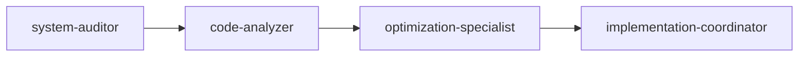

[Previous: Study consolidation architecture](command-consolidation-architecture.md) | [Return to Documentation Hub for navigation](../index.md) | [Study PRINCIPLES.md for framework](../PRINCIPLES.md) | [Next: Apply agent orchestration](agent-orchestration-framework.md)

# COMMAND ENHANCEMENT PATTERNS

⏺ **Principle**: These patterns implement [command-consolidation-architecture.md](command-consolidation-architecture.md) by providing specific methodologies for integrating principles, components, and agent orchestration into executable command structures.

## Table of Contents
- [Pattern Categories](#pattern-categories)
- [Principle Integration Patterns](#principle-integration-patterns)
- [Component Orchestration Patterns](#component-orchestration-patterns)
- [Agent Deployment Patterns](#agent-deployment-patterns)
- [Execution Flow Patterns](#execution-flow-patterns)
- [Validation Patterns](#validation-patterns)
- [Implementation Examples](#implementation-examples)
- [Pattern Selection Guidelines](#pattern-selection-guidelines)
- [Cross-References](#cross-references)

## Pattern Categories

### Enhancement Pattern Taxonomy
```
Command Enhancement Patterns
├── Principle Integration Patterns
│   ├── Direct Mapping Pattern
│   ├── Composite Integration Pattern
│   └── Dynamic Selection Pattern
├── Component Orchestration Patterns
│   ├── Sequential Component Pattern
│   ├── Parallel Component Pattern
│   └── Hierarchical Component Pattern
├── Agent Deployment Patterns
│   ├── Single Agent Pattern
│   ├── Multi-Agent Coordination Pattern
│   └── Agent Pipeline Pattern
└── Execution Flow Patterns
    ├── Linear Execution Pattern
    ├── Branched Execution Pattern
    └── Recursive Execution Pattern
```

## Principle Integration Patterns

⏺ **Principle**: These patterns implement [directive.md execution requirements](../principles/directive.md) by systematically materializing abstract principles into concrete command execution.

### Pattern 1: Direct Mapping Pattern
**Usage**: Single principle directly maps to command execution

```markdown
## Principle Integration
⏺ **Direct Mapping**: This command directly implements [workflow.md systematic execution](../principles/workflow.md) through eight-phase methodology application.

### Implementation Mapping
- **Principle Requirement**: Systematic phase execution
- **Command Implementation**: Sequential phase progression
- **Validation Criteria**: Phase completion verification
- **Success Metrics**: Systematic methodology adherence
```

### Pattern 2: Composite Integration Pattern
**Usage**: Multiple principles combine for comprehensive command execution

```markdown
## Principle Integration
⏺ **Composite Integration**: This command synthesizes [workflow.md](../principles/workflow.md), [engineering.md](../principles/engineering.md), and [agent-selection.md](../principles/agent-selection.md) for comprehensive technical analysis.

### Integration Framework
1. **Workflow Foundation**: [workflow.md] provides systematic execution phases
2. **Technical Standards**: [engineering.md] ensures quality and best practices
3. **Agent Deployment**: [agent-selection.md] optimizes specialist utilization
4. **Synthesis Result**: Comprehensive technical analysis with quality assurance
```

### Pattern 3: Dynamic Selection Pattern
**Usage**: Principle selection varies based on command parameters or context

```markdown
## Principle Integration
⏺ **Dynamic Selection**: This command applies principles contextually based on scope and complexity parameters.

### Selection Logic
```bash
if [scope=comprehensive]; then
    apply_principles=(workflow.md engineering.md validation.md)
elif [scope=analysis]; then
    apply_principles=(engineering.md fundamental.md)
elif [scope=implementation]; then
    apply_principles=(workflow.md git-workflow.md)
fi
```

## Component Orchestration Patterns

⏺ **Principle**: These patterns implement [task-orchestration.md coordination methodology](../principles/task-orchestration.md) through systematic component integration.

### Pattern 1: Sequential Component Pattern
**Usage**: Components execute in dependency order

```markdown
## Component Orchestration
### Sequential Flow
1. **Analysis Components** → Gather and process information
2. **Planning Components** → Generate implementation strategy
3. **Execution Components** → Implement planned solution
4. **Validation Components** → Verify success criteria

### Dependencies
- Planning depends on Analysis completion
- Execution depends on Planning approval
- Validation depends on Execution completion
```

### Pattern 2: Parallel Component Pattern
**Usage**: Independent components execute simultaneously

```markdown
## Component Orchestration
### Parallel Execution
```bash
# Launch parallel component execution
parallel_execute([
    "analysis/code-quality",
    "analysis/performance",
    "analysis/security",
    "analysis/documentation"
])

# Integrate results
integrate_parallel_results(all_analysis_results)
```

### Dependencies
- No inter-component dependencies
- Independent result integration
- Coordinated validation checkpoint
```

### Pattern 3: Hierarchical Component Pattern
**Usage**: Master component coordinates sub-components

```markdown
## Component Orchestration
### Hierarchical Structure
- **Master Component**: project-analysis-coordinator
  - **Sub-Component A**: architecture-analysis
  - **Sub-Component B**: code-quality-analysis  
  - **Sub-Component C**: performance-analysis
  - **Integration Layer**: result-synthesis

### Coordination Logic
1. Master component defines overall strategy
2. Sub-components execute specialized analysis
3. Master component integrates and validates results
4. Unified output generation through integration layer
```

## Agent Deployment Patterns

⏺ **Principle**: These patterns implement [agent-selection.md systematic methodology](../principles/agent-selection.md) for optimal agent utilization in command execution.

### Pattern 1: Single Agent Pattern
**Usage**: One specialized agent handles entire command execution

```markdown
## Agent Deployment Strategy
### Single Agent Configuration
- **Selected Agent**: project-optimizer
- **Rationale**: Complete project analysis requires comprehensive expertise
- **Deployment Method**: Direct task delegation via Task Tool
- **Success Criteria**: Comprehensive analysis report with actionable recommendations

### Execution Flow
```bash
deploy_agent(
    agent="project-optimizer",
    task="Complete project optimization analysis",
    context=command_context,
    success_criteria=defined_criteria
)
```
```

### Pattern 2: Multi-Agent Coordination Pattern
**Usage**: Multiple agents work together on different aspects

```markdown
## Agent Deployment Strategy
### Multi-Agent Configuration
- **Primary Agent**: project-optimizer (coordination)
- **Secondary Agents**: 
  - code-quality-specialist (code analysis)
  - performance-analyst (optimization)
  - security-auditor (vulnerability assessment)

### Coordination Protocol
1. **Phase 1**: Primary agent defines overall strategy
2. **Phase 2**: Secondary agents execute specialized analysis
3. **Phase 3**: Primary agent integrates specialist results
4. **Phase 4**: Unified report generation and validation
```

### Pattern 3: Agent Pipeline Pattern
**Usage**: Agents execute in sequence, each building on previous results

```markdown
## Agent Deployment Strategy
### Pipeline Configuration


### Pipeline Flow
1. **system-auditor**: Initial assessment and context gathering
2. **code-analyzer**: Detailed code quality and pattern analysis
3. **optimization-specialist**: Performance and efficiency recommendations
4. **implementation-coordinator**: Actionable implementation planning
```

## Execution Flow Patterns

### Pattern 1: Linear Execution Pattern
**Usage**: Straightforward sequential execution

```markdown
## Execution Framework
### Linear Flow
```bash
execute_linear() {
    phase1_result = execute_clarification()
    phase2_result = execute_exploration(phase1_result)
    phase3_result = execute_analysis(phase2_result)
    phase4_result = execute_implementation(phase3_result)
    return validate_completion(phase4_result)
}
```
```

### Pattern 2: Branched Execution Pattern
**Usage**: Conditional execution paths based on analysis results

```markdown
## Execution Framework
### Branched Flow
```bash
execute_branched() {
    analysis_result = execute_analysis()
    
    if (analysis_result.complexity == "high") {
        deploy_specialist_agent("complex-problem-solver")
    } elif (analysis_result.scope == "multi-domain") {
        deploy_multi_agent_coordination()
    } else {
        deploy_standard_agent("general-implementer")
    }
    
    return integrate_results()
}
```
```

### Pattern 3: Recursive Execution Pattern
**Usage**: Iterative improvement cycles

```markdown
## Execution Framework
### Recursive Flow
```bash
execute_recursive() {
    initial_result = execute_standard_workflow()
    
    while (!meets_quality_criteria(initial_result)) {
        improvement_areas = analyze_gaps(initial_result)
        enhanced_result = execute_improvement_cycle(improvement_areas)
        initial_result = merge_improvements(initial_result, enhanced_result)
    }
    
    return final_validated_result
}
```
```

## Validation Patterns

⏺ **Principle**: These patterns implement [validation.md comprehensive methodology](../principles/validation.md) through systematic quality assurance integration.

### Pattern 1: Gate-Based Validation
**Usage**: Quality gates at each phase transition

```markdown
## Validation Framework
### Quality Gates
- **Gate 1**: Principle compliance verification
- **Gate 2**: Component integration validation  
- **Gate 3**: Agent deployment readiness
- **Gate 4**: Execution completeness verification
- **Gate 5**: Success criteria satisfaction

### Gate Criteria
Each gate requires:
- Explicit success criteria definition
- Measurable outcome verification
- Quality standard compliance
- Stakeholder approval (where applicable)
```

### Pattern 2: Continuous Validation
**Usage**: Ongoing validation throughout execution

```markdown
## Validation Framework
### Continuous Monitoring
```bash
execute_with_validation() {
    setup_validation_monitors()
    
    for each_execution_step {
        execute_step()
        validate_step_quality()
        adjust_if_needed()
        log_validation_result()
    }
    
    generate_validation_report()
}
```
```

### Pattern 3: Recursive Validation
**Usage**: Validation loops for quality improvement

```markdown
## Validation Framework
### Recursive Quality Assurance
```bash
recursive_validation() {
    result = execute_command()
    validation_result = comprehensive_validate(result)
    
    while (!validation_result.passes_all_criteria) {
        improvement_plan = generate_improvements(validation_result.gaps)
        result = apply_improvements(result, improvement_plan)
        validation_result = comprehensive_validate(result)
    }
    
    return certified_result
}
```
```

## Implementation Examples

### Example 1: Enhanced Analysis Command
```markdown
---
title: "Enhanced System Analysis Command"
consolidation_type: "composite-integration"
principle_dependencies: ["workflow.md", "engineering.md", "agent-selection.md"]
component_dependencies: ["analysis-framework.md", "validation-protocols.md"]
agent_requirements: ["system-analysis", "multi-perspective-coordination"]
---

# ENHANCED SYSTEM ANALYSIS

## Consolidation Overview
⏺ **Consolidation**: This command materializes [workflow.md systematic execution](../principles/workflow.md), [engineering.md quality standards](../principles/engineering.md), and [agent-selection.md deployment methodology](../principles/agent-selection.md) through coordinated multi-agent analysis.

## Principle Integration (Composite Pattern)
### Primary Principles
1. **[workflow.md](../principles/workflow.md)**: Systematic eight-phase execution
2. **[engineering.md](../principles/engineering.md)**: Technical analysis standards
3. **[agent-selection.md](../principles/agent-selection.md)**: Optimal agent deployment

### Integration Synthesis
- Workflow provides systematic structure
- Engineering ensures technical quality
- Agent selection optimizes specialist utilization

## Component Orchestration (Parallel Pattern)
### Component Deployment
```bash
parallel_execute([
    "analysis/code-quality",
    "analysis/architecture",
    "analysis/performance",
    "analysis/security"
])
```

## Agent Deployment (Multi-Agent Coordination Pattern)
### Agent Configuration
- **Primary**: project-optimizer (coordination)
- **Specialists**: code-analyzer, security-auditor, performance-specialist

## Execution Framework (Branched Pattern)
### Execution Logic
```bash
if (project.complexity == "enterprise") {
    deploy_comprehensive_analysis_suite()
} elif (project.type == "security-critical") {
    prioritize_security_analysis()
} else {
    execute_standard_analysis()
}
```

## Validation (Gate-Based Pattern)
- **Gate 1**: Requirement understanding validated
- **Gate 2**: Analysis scope confirmed
- **Gate 3**: Agent deployment verified
- **Gate 4**: Results integrated and validated
```

## Pattern Selection Guidelines

### Selection Decision Matrix

| Command Type | Complexity | Domain Scope | Recommended Patterns |
|--------------|------------|--------------|---------------------|
| **Analysis** | High | Multi-domain | Composite Integration + Multi-Agent + Parallel Components |
| **Analysis** | Medium | Single-domain | Direct Mapping + Single Agent + Sequential Components |
| **Implementation** | High | Complex | Composite Integration + Agent Pipeline + Recursive Execution |
| **Implementation** | Medium | Standard | Direct Mapping + Single Agent + Linear Execution |
| **Management** | Any | Coordination | Dynamic Selection + Multi-Agent + Hierarchical Components |

### Pattern Compatibility Matrix

| Primary Pattern | Compatible Secondary | Incompatible With |
|----------------|---------------------|-------------------|
| **Direct Mapping** | Single Agent, Linear Execution | Composite Integration |
| **Composite Integration** | Multi-Agent, Parallel Components | Direct Mapping |
| **Dynamic Selection** | All Agent Patterns | Fixed Agent Assignment |

## Cross-References

### Primary Navigation
- [Return to Documentation Hub](../index.md)
- [Study consolidation architecture](command-consolidation-architecture.md)
- [Apply agent orchestration framework](agent-orchestration-framework.md)

### Related Principles
- [Study directive.md for execution requirements](../principles/directive.md)
- [Apply workflow.md for systematic execution](../principles/workflow.md)
- [Use agent-selection.md for deployment methodology](../principles/agent-selection.md)
- [Apply task-orchestration.md for coordination patterns](../principles/task-orchestration.md)

### Related Architecture
- [Use decision matrix specifications](decision-matrix-specifications.md)
- [Apply validation framework](../components/validation-framework.md)
- [Study command templates](../templates/enhanced-command-template.md)

[⬆ Return to top](#command-enhancement-patterns)