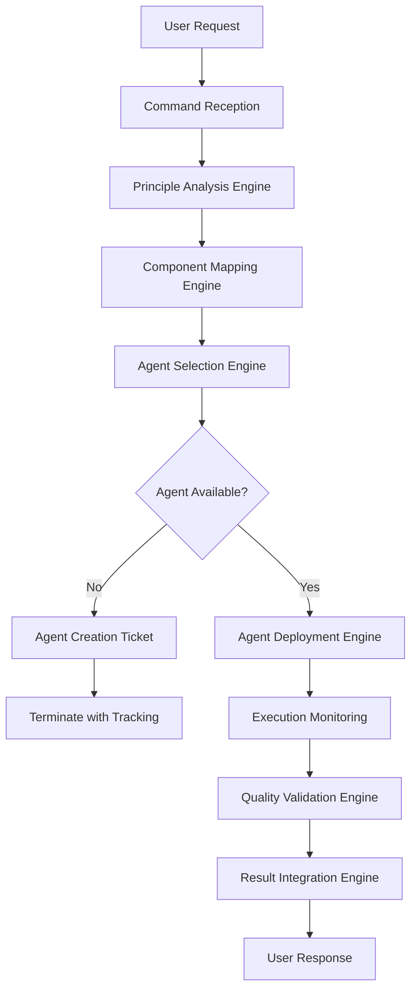

[Previous: Study PRINCIPLES.md for framework](PRINCIPLES.md) | [Return to Documentation Hub for navigation](index.md) | [Study consolidation architecture](architecture/command-consolidation-architecture.md) | [Next: Browse Commands Index](../commands/index.md)

# COMMAND CONSOLIDATION SPECIFICATION

⏺ **Principle**: This specification implements [directive.md execution requirements](principles/directive.md) by establishing commands as the ULTIMATE CONSOLIDATION LAYER where principles, components, agents, and execution converge into a unified, actionable system.

## Table of Contents
  - [Executive Summary](#executive-summary)
- [Vision Statement](#vision-statement)
- [Core Transformation](#core-transformation)
- [Key Benefits](#key-benefits)
  - [System Architecture Overview](#system-architecture-overview)
- [Architectural Pillars](#architectural-pillars)
- [System-Wide Flow](#system-wide-flow)
  - [Consolidation Framework](#consolidation-framework)
- [Framework Components](#framework-components)
- [Consolidation Patterns](#consolidation-patterns)
  - [Complete Integration Implementation](#complete-integration-implementation)
- [Consolidation Flow](#consolidation-flow)
- [Quality Gates](#quality-gates)
  - [Focused Integration Implementation](#focused-integration-implementation)
- [Selective Consolidation](#selective-consolidation)
- [Efficiency Optimization](#efficiency-optimization)
  - [Adaptive Integration Implementation](#adaptive-integration-implementation)
- [Dynamic Consolidation](#dynamic-consolidation)
- [Adaptation Logic](#adaptation-logic)
  - [Implementation Roadmap](#implementation-roadmap)
- [Phase 1: Foundation Enhancement (Weeks 1-2)](#phase-1-foundation-enhancement-weeks-1-2-)
- [Phase 2: Command Enhancement (Weeks 3-4)](#phase-2-command-enhancement-weeks-3-4-)
- [Phase 3: Agent Integration (Weeks 5-6)](#phase-3-agent-integration-weeks-5-6-)
- [Phase 4: Validation and Testing (Weeks 7-8)](#phase-4-validation-and-testing-weeks-7-8-)
  - [Technical Specifications](#technical-specifications)
- [Command Structure Specification](#command-structure-specification)
- [Decision Matrix Specification](#decision-matrix-specification)
- [Quality Assurance Specification](#quality-assurance-specification)
  - [Quality Assurance Framework](#quality-assurance-framework)
- [Quality Dimensions](#quality-dimensions)
- [Quality Validation Protocol](#quality-validation-protocol)
  - [Migration Strategy](#migration-strategy)
- [Migration Phases](#migration-phases)
- [Risk Mitigation](#risk-mitigation)
  - [Validation and Testing](#validation-and-testing)
- [Testing Framework](#testing-framework)
- [Success Criteria](#success-criteria)
  - [Operational Guidelines](#operational-guidelines)
- [Daily Operations](#daily-operations)
- [Maintenance and Evolution](#maintenance-and-evolution)
- [Performance Metrics](#performance-metrics)
  - [Cross-References](#cross-references)
- [Primary Navigation](#primary-navigation)
- [Architecture Documentation](#architecture-documentation)
- [Related Principles](#related-principles)
- [Implementation Resources](#implementation-resources)
- [Quality Framework](#quality-framework)
- [Principle References](#principle-references)
- [Cross-References](#cross-references)

## Executive Summary

### Vision Statement
Transform the Claude Code framework into a command-centric architecture where **commands serve as the single consolidation layer** that materializes the entire conceptual framework into executable instructions.

### Core Transformation
```
BEFORE: Scattered Integration
┌─────────────┐    ┌─────────────┐    ┌─────────────┐
│ PRINCIPLES  │    │ COMPONENTS  │    │   AGENTS    │
│ (isolated)  │    │ (separate)  │    │ (disconnected)│
└─────────────┘    └─────────────┘    └─────────────┘
        │                  │                  │
        └──────────────────┼──────────────────┘
                           │
                    ┌─────────────┐
                    │ SCATTERED   │
                    │ EXECUTION   │
                    └─────────────┘

AFTER: Command-Centered Consolidation
┌─────────────────────────────────────────────────────────────┐
│              COMMAND CONSOLIDATION LAYER                    │
│  ┌─────────────┐  ┌─────────────┐  ┌─────────────────────┐ │
│  │ PRINCIPLES  │◄─┤   COMMAND   ├─►│    COMPONENTS       │ │
│  │Integration  │  │Consolidator │  │ Implementation      │ │
│  │  Engine     │  │   Hub       │  │    Engine           │ │
│  └─────────────┘  └─────┬───────┘  └─────────────────────┘ │
└────────────────────────┼─────────────────────────────────────┘
                         │
┌────────────────────────▼─────────────────────────────────────┐
│           UNIFIED EXECUTION WITH AGENT ORCHESTRATION        │
└─────────────────────────────────────────────────────────────┘
```

### Key Benefits
1. **Single Point of Integration**: Commands become the definitive instruction set
2. **Systematic Execution**: All operations follow consistent consolidation patterns
3. **Quality Assurance**: Built-in validation and quality gates
4. **Agent Orchestration**: Seamless specialist deployment and coordination
5. **Framework Coherence**: Complete alignment between theory and practice

## System Architecture Overview

⏺ **Principle**: This architecture implements [command-consolidation-architecture.md](architecture/command-consolidation-architecture.md) by establishing a comprehensive consolidation framework.

### Architectural Pillars

#### Pillar 1: Principle Integration Engine
```
Principle Integration Process:
┌─────────────────┐
│ Command Request │
└─────────┬───────┘
          │
┌─────────▼───────┐
│ Principle       │ ← Analyze applicable principles
│ Analysis        │   Map to command execution
└─────────┬───────┘   Generate compliance checklist
          │
┌─────────▼───────┐
│ Principle       │ ← Direct mapping
│ Application     │   Composite integration  
└─────────┬───────┘   Dynamic selection
          │
┌─────────▼───────┐
│ Materialization │ ← Transform into executable actions
│ Into Actions    │   Maintain principle traceability
└─────────────────┘
```

#### Pillar 2: Component Orchestration Engine
```
Component Orchestration Process:
┌─────────────────┐
│ Principle       │
│ Requirements    │
└─────────┬───────┘
          │
┌─────────▼───────┐
│ Component       │ ← Map principles to components
│ Mapping         │   Identify required patterns
└─────────┬───────┘   Plan integration strategy
          │
┌─────────▼───────┐
│ Component       │ ← Sequential execution
│ Execution       │   Parallel coordination
└─────────┬───────┘   Hierarchical management
          │
┌─────────▼───────┐
│ Integration     │ ← Synthesize component outputs
│ Synthesis       │   Validate consistency
└─────────────────┘
```

#### Pillar 3: Agent Orchestration Engine
```
Agent Orchestration Process:
┌─────────────────┐
│ Component       │
│ Requirements    │
└─────────┬───────┘
          │
┌─────────▼───────┐
│ Agent           │ ← Apply decision matrices
│ Selection       │   Evaluate capabilities
└─────────┬───────┘   Generate creation tickets
          │
┌─────────▼───────┐
│ Agent           │ ← Single agent deployment
│ Deployment      │   Multi-agent coordination
└─────────┬───────┘   Hierarchical orchestration
          │
┌─────────▼───────┐
│ Quality         │ ← Validate outputs
│ Integration     │   Integrate results
└─────────────────┘
```

### System-Wide Flow


## Consolidation Framework

⏺ **Principle**: This framework implements [command-enhancement-patterns.md](architecture/command-enhancement-patterns.md) through systematic integration methodologies.

### Framework Components

#### Component 1: Principle-to-Execution Materialization
```yaml
materialization_framework:
  principle_analysis:
    - identify_applicable_principles()
    - map_principle_requirements()
    - generate_compliance_checklist()
  
  component_mapping:
    - select_implementation_patterns()
    - design_integration_strategy()
    - plan_execution_sequence()
  
  agent_orchestration:
    - apply_selection_matrices()
    - coordinate_specialist_deployment()
    - manage_quality_assurance()
  
  execution_synthesis:
    - integrate_all_outputs()
    - validate_objective_achievement()
    - deliver_unified_result()
```

#### Component 2: Command Enhancement Framework
```yaml
enhancement_framework:
  command_structure:
    - principle_integration_section
    - component_orchestration_section
    - agent_deployment_strategy
    - execution_framework
    - validation_protocols
  
  integration_patterns:
    - direct_mapping_pattern
    - composite_integration_pattern
    - dynamic_selection_pattern
  
  orchestration_patterns:
    - single_agent_deployment
    - parallel_coordination
    - hierarchical_management
    - sequential_pipeline
```

#### Component 3: Decision Integration Framework
```yaml
decision_framework:
  selection_matrices:
    - agent_capability_assessment
    - task_complexity_analysis
    - domain_coverage_evaluation
    - quality_requirement_matching
  
  creation_decisions:
    - gap_analysis_methodology
    - justification_assessment
    - cost_benefit_evaluation
    - priority_classification
  
  orchestration_decisions:
    - coordination_pattern_selection
    - resource_allocation_optimization
    - quality_gate_establishment
    - performance_monitoring
```

### Consolidation Patterns

#### Pattern 1: Complete Integration Pattern
**Usage**: Complex tasks requiring full framework integration

```markdown
## Complete Integration Implementation
### Consolidation Flow
1. **Principle Analysis** → Identify all applicable principles
2. **Component Mapping** → Map principles to implementation patterns
3. **Agent Orchestration** → Deploy optimal agent coordination
4. **Quality Synthesis** → Integrate and validate all outputs

### Quality Gates
- **Gate 1**: Principle compliance verification
- **Gate 2**: Component integration validation
- **Gate 3**: Agent deployment readiness
- **Gate 4**: Output quality certification
```

#### Pattern 2: Focused Integration Pattern
**Usage**: Targeted tasks with specific integration needs

```markdown
## Focused Integration Implementation
### Selective Consolidation
1. **Targeted Analysis** → Focus on specific principles/components
2. **Optimized Mapping** → Minimal required integration
3. **Efficient Orchestration** → Single or minimal agent deployment
4. **Streamlined Validation** → Essential quality checks

### Efficiency Optimization
- Minimize consolidation overhead
- Focus on core requirements
- Streamline validation processes
```

#### Pattern 3: Adaptive Integration Pattern
**Usage**: Variable complexity with context-dependent integration

```markdown
## Adaptive Integration Implementation
### Dynamic Consolidation
1. **Context Assessment** → Evaluate integration complexity
2. **Adaptive Selection** → Choose appropriate consolidation level
3. **Flexible Orchestration** → Scale coordination to requirements
4. **Contextual Validation** → Adjust quality gates to context

### Adaptation Logic
- Simple tasks → Minimal integration
- Complex tasks → Full consolidation
- Variable tasks → Context-driven decisions
```

## Implementation Roadmap

### Phase 1: Foundation Enhancement (Weeks 1-2)
```yaml
foundation_tasks:
  documentation_creation:
    - ✅ command-consolidation-architecture.md
    - ✅ command-enhancement-patterns.md  
    - ✅ decision-matrix-specifications.md
    - ✅ agent-orchestration-framework.md
    - ✅ command-consolidation-specification.md
  
  framework_preparation:
    - update_existing_commands_with_consolidation_sections
    - create_enhanced_command_templates
    - establish_consolidation_validation_criteria
```

### Phase 2: Command Enhancement (Weeks 3-4)
```yaml
enhancement_tasks:
  workflow_commands:
    - enhance_1-clarify_with_consolidation
    - enhance_2-explore_with_consolidation
    - enhance_3-analyze_with_consolidation
    - enhance_4-present-solutions_with_consolidation
    - enhance_5-plan_with_consolidation
    - enhance_6-implement_with_consolidation
    - enhance_7-ripple-effect_with_consolidation
    - enhance_8-validate_with_consolidation
  
  specialized_commands:
    - enhance_analysis_commands
    - enhance_execution_commands
    - enhance_management_commands
    - enhance_composition_commands
```

### Phase 3: Agent Integration (Weeks 5-6)
```yaml
integration_tasks:
  orchestration_enhancement:
    - implement_decision_matrices_in_commands
    - create_agent_coordination_protocols
    - establish_quality_validation_frameworks
    - develop_performance_monitoring_systems
  
  agent_development:
    - create_missing_specialized_agents
    - enhance_existing_agent_capabilities
    - implement_agent_coordination_patterns
    - establish_agent_quality_standards
```

### Phase 4: Validation and Testing (Weeks 7-8)
```yaml
validation_tasks:
  quality_assurance:
    - test_all_consolidation_patterns
    - validate_integration_completeness
    - verify_performance_optimization
    - confirm_user_experience_improvement
  
  system_verification:
    - end_to_end_workflow_testing
    - multi_agent_coordination_validation
    - quality_gate_effectiveness_verification
    - documentation_completeness_audit
```

## Technical Specifications

### Command Structure Specification
```yaml
enhanced_command_structure:
  metadata:
    - title: "Command Name"
    - consolidation_type: "[integration|orchestration|coordination]"
    - principle_dependencies: ["principle1.md", "principle2.md"]
    - component_dependencies: ["component1.md", "component2.md"]
    - agent_requirements: ["capabilities", "coordination_patterns"]
  
  consolidation_sections:
    principle_integration:
      - consolidation_statement
      - principle_mapping
      - compliance_requirements
    
    component_orchestration:
      - component_selection
      - integration_patterns
      - execution_coordination
    
    agent_deployment:
      - selection_criteria
      - orchestration_patterns
      - quality_requirements
    
    execution_framework:
      - workflow_integration
      - validation_protocols
      - success_criteria
```

### Decision Matrix Specification
```yaml
decision_matrix_implementation:
  capability_scoring:
    - capability_score: "0.0 - 1.0"
    - domain_score: "0.0 - 1.0" 
    - complexity_score: "0.0 - 1.0"
    - total_threshold: "0.8 for deployment, 0.6 for evaluation"
  
  creation_justification:
    - mandatory: "critical_capability_gap"
    - strong: "significant_improvement >50%"
    - moderate: "meaningful_benefit 25-50%"
    - weak: "marginal_benefit 10-25%"
    - none: "no_clear_benefit <10%"
  
  orchestration_patterns:
    - single_agent: "simple_tasks_clear_match"
    - parallel_agents: "independent_parallel_components"
    - hierarchical_agents: "complex_coordination_required"
    - sequential_pipeline: "dependency_chain_execution"
```

### Quality Assurance Specification
```yaml
quality_framework:
  validation_levels:
    agent_level:
      - pre_execution_validation
      - execution_monitoring
      - output_validation
      - quality_certification
    
    coordination_level:
      - coordination_integrity
      - integration_validation
      - consistency_verification
    
    command_level:
      - objective_fulfillment
      - quality_standards_compliance
      - user_satisfaction_validation
  
  quality_gates:
    pre_deployment:
      - agent_capability_verification
      - task_specification_completeness
      - success_criteria_definition
    
    execution:
      - progress_milestone_validation
      - quality_checkpoint_verification
      - coordination_integrity_checks
    
    post_execution:
      - output_quality_validation
      - success_criteria_verification
      - integration_compatibility_check
```

## Quality Assurance Framework

⏺ **Principle**: This framework implements [validation.md comprehensive methodology](principles/validation.md) through integrated quality assurance across all consolidation layers.

### Quality Dimensions

#### Dimension 1: Integration Quality
```yaml
integration_quality:
  principle_integration:
    - completeness: "all_applicable_principles_included"
    - accuracy: "correct_principle_application"
    - consistency: "coherent_principle_synthesis"
  
  component_integration:
    - coverage: "required_components_included"
    - coordination: "effective_component_orchestration"
    - efficiency: "optimal_resource_utilization"
  
  agent_integration:
    - selection: "optimal_agent_deployment"
    - coordination: "effective_multi_agent_management"
    - validation: "quality_output_verification"
```

#### Dimension 2: Execution Quality
```yaml
execution_quality:
  workflow_adherence:
    - systematic_execution: "eight_phase_methodology"
    - phase_completion: "thorough_phase_validation"
    - progression_logic: "logical_phase_transitions"
  
  output_quality:
    - requirement_fulfillment: "complete_objective_achievement"
    - quality_standards: "framework_compliance"
    - user_satisfaction: "expectation_fulfillment"
```

#### Dimension 3: System Quality
```yaml
system_quality:
  architectural_integrity:
    - consolidation_completeness: "full_framework_integration"
    - pattern_consistency: "standardized_implementation"
    - scalability: "growth_accommodation"
  
  operational_excellence:
    - performance_optimization: "efficient_execution"
    - error_handling: "robust_failure_recovery"
    - monitoring: "comprehensive_observability"
```

### Quality Validation Protocol
```bash
# Comprehensive Quality Validation
validate_consolidation_quality() {
    # Layer 1: Integration Quality
    integration_score = validate_integration_quality()
    
    # Layer 2: Execution Quality  
    execution_score = validate_execution_quality()
    
    # Layer 3: System Quality
    system_score = validate_system_quality()
    
    # Overall Quality Assessment
    overall_quality = calculate_weighted_quality_score(
        integration_score * 0.4,
        execution_score * 0.4,
        system_score * 0.2
    )
    
    return generate_quality_certification(overall_quality)
}
```

## Migration Strategy

### Migration Phases

#### Phase 1: Assessment and Preparation
```yaml
assessment_phase:
  current_state_analysis:
    - audit_existing_commands
    - identify_enhancement_opportunities
    - assess_integration_gaps
    - evaluate_agent_capabilities
  
  preparation_tasks:
    - create_migration_planning
    - establish_quality_baselines
    - prepare_testing_frameworks
    - design_rollback_procedures
```

#### Phase 2: Incremental Enhancement
```yaml
enhancement_phase:
  priority_based_migration:
    - high_impact_commands_first
    - systematic_enhancement_application
    - quality_validation_at_each_step
    - user_experience_preservation
  
  validation_checkpoints:
    - functionality_preservation_verification
    - quality_improvement_measurement
    - performance_impact_assessment
    - user_satisfaction_tracking
```

#### Phase 3: System Integration
```yaml
integration_phase:
  comprehensive_integration:
    - cross_command_consistency_verification
    - agent_coordination_optimization
    - quality_framework_validation
    - documentation_synchronization
  
  final_validation:
    - end_to_end_testing
    - performance_benchmarking
    - user_acceptance_validation
    - system_certification
```

### Risk Mitigation
```yaml
risk_mitigation:
  technical_risks:
    - backward_compatibility_maintenance
    - performance_regression_prevention
    - quality_standard_preservation
    - integration_failure_recovery
  
  operational_risks:
    - user_workflow_disruption_minimization
    - training_requirement_management
    - change_management_coordination
    - support_system_preparation
```

## Validation and Testing

### Testing Framework

#### Unit Testing: Individual Command Enhancement
```bash
# Command Enhancement Testing
test_command_enhancement() {
    # Test principle integration
    validate_principle_integration_completeness()
    validate_principle_application_accuracy()
    
    # Test component orchestration
    validate_component_selection_logic()
    validate_component_coordination_effectiveness()
    
    # Test agent deployment
    validate_agent_selection_decisions()
    validate_agent_orchestration_patterns()
    
    # Test quality assurance
    validate_quality_gate_functionality()
    validate_validation_protocol_effectiveness()
}
```

#### Integration Testing: Multi-Command Workflows
```bash
# Integration Testing Framework
test_command_integration() {
    # Test workflow continuity
    validate_phase_to_phase_integration()
    validate_cross_command_data_flow()
    
    # Test agent coordination
    validate_multi_agent_coordination()
    validate_agent_handoff_protocols()
    
    # Test quality consistency
    validate_consistent_quality_standards()
    validate_integrated_validation_protocols()
}
```

#### System Testing: End-to-End Validation
```bash
# System Testing Framework
test_system_integration() {
    # Test complete workflows
    execute_full_workflow_scenarios()
    validate_user_experience_quality()
    
    # Test performance characteristics
    measure_execution_performance()
    validate_resource_utilization()
    
    # Test quality outcomes
    verify_objective_achievement_rates()
    validate_user_satisfaction_levels()
}
```

### Success Criteria
```yaml
success_criteria:
  functionality_criteria:
    - all_existing_functionality_preserved: "100%"
    - new_consolidation_features_operational: "100%"
    - quality_improvements_measurable: ">25%"
  
  performance_criteria:
    - execution_time_improvement: ">10%"
    - resource_utilization_optimization: ">15%"
    - error_rate_reduction: ">20%"
  
  quality_criteria:
    - user_satisfaction_improvement: ">30%"
    - output_quality_enhancement: ">25%"
    - system_reliability_increase: ">20%"
```

## Operational Guidelines

⏺ **Principle**: These guidelines implement [organization.md systematic structure](principles/organization.md) for effective command consolidation operation.

### Daily Operations

#### Command Selection and Execution
```yaml
daily_operations:
  command_selection:
    - analyze_user_request_complexity
    - identify_required_consolidation_level
    - select_appropriate_command_pattern
    - prepare_execution_context
  
  execution_monitoring:
    - track_consolidation_effectiveness
    - monitor_agent_coordination_quality
    - validate_quality_gate_compliance
    - measure_user_satisfaction
```

#### Quality Assurance Practices
```yaml
quality_practices:
  continuous_validation:
    - real_time_quality_monitoring
    - proactive_issue_identification
    - immediate_corrective_action
    - continuous_improvement_implementation
  
  performance_optimization:
    - regular_performance_assessment
    - bottleneck_identification_and_resolution
    - resource_allocation_optimization
    - efficiency_enhancement_implementation
```

### Maintenance and Evolution

#### System Maintenance
```yaml
maintenance_practices:
  regular_maintenance:
    - command_effectiveness_review
    - agent_capability_assessment
    - quality_framework_evaluation
    - documentation_currency_verification
  
  continuous_improvement:
    - user_feedback_integration
    - performance_metric_analysis
    - best_practice_identification
    - framework_enhancement_implementation
```

#### Evolution Management
```yaml
evolution_management:
  capability_expansion:
    - new_agent_development_planning
    - command_enhancement_prioritization
    - quality_standard_evolution
    - framework_scalability_improvement
  
  innovation_integration:
    - emerging_best_practice_adoption
    - technology_advancement_integration
    - user_requirement_evolution_accommodation
    - system_architecture_modernization
```

### Performance Metrics

#### Consolidation Effectiveness Metrics
```yaml
effectiveness_metrics:
  integration_quality:
    - principle_compliance_rate: "target: >95%"
    - component_utilization_efficiency: "target: >90%"
    - agent_deployment_optimization: "target: >85%"
  
  execution_quality:
    - workflow_completion_rate: "target: >98%"
    - quality_gate_pass_rate: "target: >95%"
    - user_satisfaction_score: "target: >4.5/5"
```

#### System Performance Metrics
```yaml
performance_metrics:
  operational_efficiency:
    - average_execution_time: "baseline: current, target: -15%"
    - resource_utilization_rate: "target: >80%"
    - error_recovery_success_rate: "target: >90%"
  
  quality_outcomes:
    - output_quality_score: "target: >4.0/5"
    - requirement_fulfillment_rate: "target: >95%"
    - continuous_improvement_velocity: "target: monthly enhancements"
```

## Cross-References

### Primary Navigation
- [Return to Documentation Hub](index.md)
- [Study PRINCIPLES.md for framework](PRINCIPLES.md)
- [Browse Commands Index](../commands/index.md)

### Architecture Documentation
- [Study command consolidation architecture](architecture/command-consolidation-architecture.md)
- [Apply command enhancement patterns](architecture/command-enhancement-patterns.md)
- [Use decision matrix specifications](architecture/decision-matrix-specifications.md)
- [Apply agent orchestration framework](architecture/agent-orchestration-framework.md)

### Related Principles
- [Study directive.md for execution requirements](principles/directive.md)
- [Apply workflow.md for systematic execution](principles/workflow.md)
- [Use agent-selection.md for deployment methodology](principles/agent-selection.md)
- [Apply task-orchestration.md for coordination patterns](principles/task-orchestration.md)
- [Apply validation.md for quality assurance](principles/validation.md)

### Implementation Resources
- [Browse existing agents](../agents/)
- [Review ticket registry](planning/TICKET_REGISTRY.md)
- [Study workflow phases](templates/components/workflow-phases.md)
- [Use command templates](templates/enhanced-command-template.md)

### Quality Framework
- [Apply validation methodology](principles/validation.md)
- [Use quality components](templates/components/quality-frameworks.md)
- [Follow engineering standards](principles/engineering.md)

[⬆ Return to top](#command-consolidation-specification)