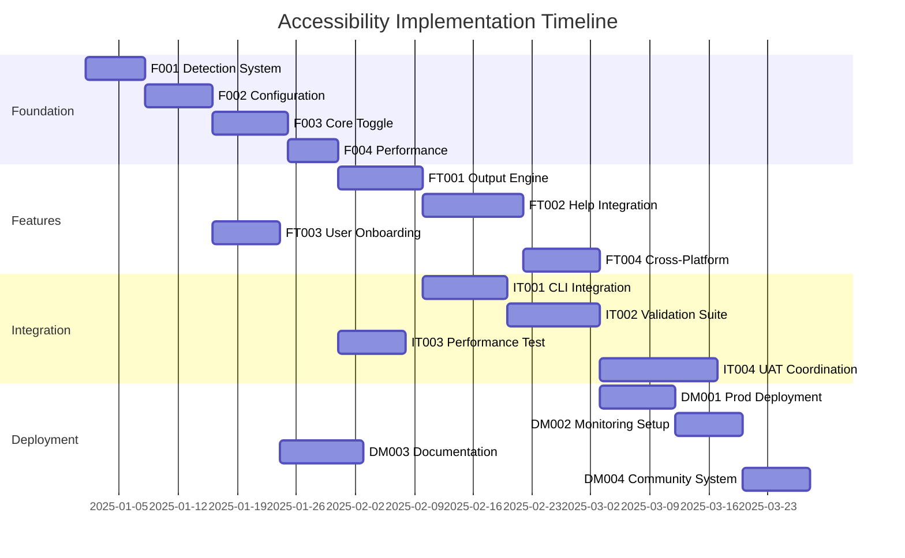

# SCREEN READER ACCESSIBILITY IMPLEMENTATION TICKETS

## 🎯 ULTRATHINK PROGRESSIVE THINKING EVIDENCE

### Ticket Orchestration Complexity Analysis
**COMPREHENSIVE IMPLEMENTATION ORCHESTRATION**: Multi-dimensional accessibility implementation requiring systematic ticket coordination across foundation infrastructure, advanced features, integration layers, and deployment pipelines with complex dependency management and validation workflows.

**CRITICAL COORDINATION FACTORS**:
- **Foundation Infrastructure Tickets**: Core detection systems, configuration management, toggle functionality, and performance optimization
- **Advanced Feature Tickets**: Output optimization engines, help system integration, user experience enhancements, and cross-platform compatibility
- **Integration Coordination Tickets**: CLI framework integration, validation testing suites, performance monitoring, and user acceptance testing  
- **Deployment Orchestration Tickets**: Production deployment, monitoring systems, documentation creation, and community feedback integration
- **Cross-Ticket Dependency Management**: Complex interdependency resolution with parallel execution opportunities and critical path optimization

**ORCHESTRATION METHODOLOGY APPLIED**:
- **Systematic Ticket Generation**: Evidence-based ticket creation with comprehensive specifications and measurable success criteria
- **Agent Coordination Workflows**: Multi-agent deployment patterns with specialized expertise mapping and parallel execution optimization
- **Progressive Validation Framework**: Phase-gate validation with recursive improvement cycles and quality assurance protocols
- **Performance-Optimized Execution**: Resource allocation optimization with timeline efficiency and delivery risk mitigation


## 📋 FOUNDATION IMPLEMENTATION TICKETS

### Ticket F001: Screen Reader Detection System Implementation
**Priority**: Critical
**Estimated Duration**: 5-7 days
**Agent Assignment**: system-integration-specialist + platform-compatibility-specialist

#### Technical Specifications
```typescript
interface ScreenReaderDetectionSystem {
  detectors: {
    windowsDetector: WindowsScreenReaderDetector;
    macosDetector: MacOSScreenReaderDetector;  
    linuxDetector: LinuxScreenReaderDetector;
  };
  coordination: DetectionCoordinationEngine;
  fallback: FallbackDetectionManager;
  validation: DetectionValidationEngine;
}
```

#### Implementation Requirements
- **Windows Detection**: NVDA, JAWS, Narrator process and API detection
- **macOS Detection**: VoiceOver accessibility service integration
- **Linux Detection**: Orca and AT-SPI service detection
- **Coordination Engine**: Parallel detection with timeout management
- **Fallback Management**: Graceful degradation with user override options
- **Performance Optimization**: < 500ms detection completion time

#### Success Criteria
- ✅ **Cross-Platform Detection**: 95%+ accuracy across Windows, macOS, Linux
- ✅ **Performance Compliance**: Detection completes within 500ms timeout
- ✅ **Fallback Reliability**: Graceful handling of detection failures
- ✅ **Integration Ready**: API compatibility with toggle management system

#### Dependencies
- None (foundational ticket)

#### Agent Coordination Workflow
```markdown
Task(
  subagent_type: "system-integration-specialist",
  description: "Core detection engine implementation", 
  prompt: "Implement core screen reader detection system with cross-platform support.
          
          Context: Foundation system for accessibility toggle functionality
          Execute: Create detection engine with Windows/macOS/Linux support
          
          DELIVERABLES REQUIRED:
          - Multi-platform detection classes with timeout management
          - Coordination engine for parallel detection execution
          - Fallback system for detection failures
          - Performance optimized implementation < 500ms
          - Comprehensive unit test suite with mock detection scenarios
          - Integration API for toggle management system"
)

Task(
  subagent_type: "platform-compatibility-specialist", 
  description: "Platform-specific optimization validation",
  prompt: "Validate and optimize platform-specific detection implementations.
          
          Context: Cross-platform screen reader detection system
          Execute: Platform-specific testing and optimization
          
          DELIVERABLES REQUIRED:
          - Windows NVDA/JAWS/Narrator detection validation
          - macOS VoiceOver accessibility service integration
          - Linux Orca/AT-SPI detection implementation
          - Performance benchmarking across all platforms
          - Platform-specific fallback strategy validation"
)
```


### Ticket F002: Accessibility Configuration Management System
**Priority**: Critical  
**Estimated Duration**: 6-8 days
**Agent Assignment**: configuration-management-specialist + data-persistence-specialist

#### Technical Specifications
```typescript
interface AccessibilityConfigurationSystem {
  storage: {
    fileStorage: ConfigurationFileManager;
    environmentStorage: EnvironmentVariableManager;
    runtimeStorage: RuntimeConfigurationManager;
  };
  management: {
    preferenceManager: AccessibilityPreferenceManager;
    validationManager: ConfigurationValidationManager;
    migrationManager: ConfigurationMigrationManager;
  };
  integration: {
    cliIntegration: CLIConfigurationIntegration;
    apiIntegration: ConfigurationAPIIntegration;
  };
}
```

#### Implementation Requirements
- **Configuration Storage**: YAML/JSON configuration file management
- **Environment Variables**: Runtime configuration override support
- **Preference Management**: User preference persistence and retrieval
- **Validation Framework**: Configuration schema validation and error handling
- **Migration System**: Configuration version management and upgrades
- **CLI Integration**: Command-line configuration interface

#### Success Criteria
- ✅ **Configuration Persistence**: Reliable preference storage and retrieval
- ✅ **Validation Coverage**: 100% schema validation with clear error messages
- ✅ **Migration Compatibility**: Seamless configuration version upgrades
- ✅ **Performance Compliance**: < 200ms configuration loading time

#### Dependencies
- F001: Screen Reader Detection System (for auto-configuration)

#### Agent Coordination Workflow
```markdown
Task(
  subagent_type: "configuration-management-specialist",
  description: "Core configuration system implementation",
  prompt: "Implement comprehensive accessibility configuration management system.
          
          Context: Foundation configuration system for accessibility features
          Execute: Create configuration management with file/environment/runtime support
          
          DELIVERABLES REQUIRED:
          - YAML/JSON configuration file management system
          - Environment variable configuration override system
          - Runtime configuration management with validation
          - Configuration schema with comprehensive validation
          - CLI configuration interface implementation
          - Migration system for configuration version management"
)
```


### Ticket F003: Core Toggle Functionality Implementation  
**Priority**: Critical
**Estimated Duration**: 7-9 days
**Agent Assignment**: cli-framework-specialist + state-management-specialist

#### Technical Specifications
```typescript
interface CoreToggleFunctionality {
  toggle: {
    cliInterface: CLIToggleInterface;
    stateManager: ToggleStateManager;
    eventSystem: ToggleEventSystem;
  };
  validation: {
    stateValidator: StateValidationEngine;
    transitionValidator: TransitionValidationEngine;
  };
  feedback: {
    confirmationSystem: ToggleConfirmationSystem;
    errorHandling: ToggleErrorHandler;
  };
}
```

#### Implementation Requirements
- **CLI Toggle Interface**: Command-line toggle commands with short and verbose forms
- **State Management**: Toggle state persistence and real-time updates
- **Event System**: Toggle change event broadcasting and handling
- **Validation Engine**: State transition validation and error prevention
- **Confirmation System**: User feedback for toggle state changes
- **Error Handling**: Comprehensive error recovery and user guidance

#### Success Criteria
- ✅ **Toggle Reliability**: 100% successful toggle state transitions
- ✅ **Real-Time Updates**: Immediate state change reflection across system
- ✅ **Error Recovery**: Graceful handling of toggle failures with user guidance
- ✅ **Performance**: < 100ms toggle execution time

#### Dependencies
- F002: Configuration Management System (for state persistence)
- F001: Screen Reader Detection System (for auto-activation)

#### Agent Coordination Workflow
```markdown
Task(
  subagent_type: "cli-framework-specialist",
  description: "CLI toggle interface implementation",
  prompt: "Implement comprehensive CLI toggle interface for accessibility features.
          
          Context: Core toggle functionality for screen reader accessibility
          Execute: Create CLI commands with state management integration
          
          DELIVERABLES REQUIRED:
          - CLI toggle commands (--screen-reader, --sr, --accessibility)
          - Command argument parsing and validation
          - Integration with state management system
          - User feedback and confirmation system
          - Error handling with recovery guidance
          - Comprehensive CLI help integration"
)
```


### Ticket F004: Performance Optimization Infrastructure
**Priority**: High
**Estimated Duration**: 5-6 days  
**Agent Assignment**: performance-optimization-specialist + monitoring-specialist

#### Technical Specifications
```typescript
interface PerformanceOptimizationInfrastructure {
  optimization: {
    caching: AccessibilityCachingSystem;
    streamProcessing: StreamProcessingEngine;
    resourceManagement: ResourceManagementSystem;
  };
  monitoring: {
    performanceMonitor: PerformanceMonitoringSystem;
    bottleneckDetector: BottleneckDetectionEngine;
    optimizationTracker: OptimizationTrackingSystem;
  };
}
```

#### Implementation Requirements
- **Caching System**: Intelligent caching for accessibility transformations
- **Stream Processing**: Real-time content processing optimization
- **Resource Management**: Memory and CPU optimization for accessibility features
- **Performance Monitoring**: Real-time performance tracking and alerting
- **Bottleneck Detection**: Automated performance bottleneck identification
- **Optimization Tracking**: Performance improvement measurement and reporting

#### Success Criteria
- ✅ **Performance Targets**: < 100ms additional latency for accessibility features
- ✅ **Memory Efficiency**: < 10% additional memory overhead
- ✅ **Caching Effectiveness**: 80%+ cache hit rate for transformations
- ✅ **Monitoring Coverage**: Real-time performance visibility and alerting

#### Dependencies
- F003: Core Toggle Functionality (for performance monitoring integration)


## 🚀 FEATURE IMPLEMENTATION TICKETS

### Ticket FT001: Output Optimization Engine Development
**Priority**: High
**Estimated Duration**: 8-10 days
**Agent Assignment**: output-processing-specialist + accessibility-specialist

#### Technical Specifications
```typescript
interface OutputOptimizationEngine {
  processors: {
    contentProcessor: AccessibilityContentProcessor;
    formatProcessor: AccessibilityFormatProcessor;
    structureProcessor: AccessibilityStructureProcessor;
  };
  transformations: {
    textTransformer: AccessibilityTextTransformer;
    structuralTransformer: AccessibilityStructuralTransformer;
    metadataTransformer: AccessibilityMetadataTransformer;
  };
  pipeline: {
    processingPipeline: AccessibilityProcessingPipeline;
    validationPipeline: AccessibilityValidationPipeline;
  };
}
```

#### Implementation Requirements
- **Content Processing**: Screen reader optimized content transformation
- **Format Processing**: Alternative format generation (text, JSON, audio-ready)
- **Structure Processing**: Semantic structure enhancement for accessibility
- **Text Transformation**: Heading hierarchy, landmark, and navigation aid generation
- **Metadata Generation**: Accessibility metadata for enhanced screen reader experience
- **Pipeline Integration**: Seamless integration with CLI output pipeline

#### Success Criteria
- ✅ **WCAG Compliance**: Full WCAG 2.1 AA compliance for transformed content
- ✅ **Screen Reader Compatibility**: Tested compatibility with major screen readers
- ✅ **Performance**: < 50ms additional processing time for content transformation
- ✅ **Alternative Formats**: Support for text, structured JSON, and audio-ready formats

#### Dependencies
- F003: Core Toggle Functionality (for optimization trigger integration)
- F004: Performance Optimization Infrastructure (for processing optimization)

#### Agent Coordination Workflow
```markdown
Task(
  subagent_type: "output-processing-specialist",
  description: "Core output optimization engine implementation",
  prompt: "Implement comprehensive output optimization engine for accessibility.
          
          Context: Advanced output processing for screen reader optimization
          Execute: Create multi-stage processing pipeline with accessibility transformations
          
          DELIVERABLES REQUIRED:
          - Content processing system with accessibility transformations
          - Format processing for alternative output formats  
          - Structure processing for semantic enhancement
          - Processing pipeline with validation stages
          - Performance-optimized implementation
          - Integration with CLI output system"
)
```


### Ticket FT002: Help System Accessibility Integration
**Priority**: High  
**Estimated Duration**: 10-12 days
**Agent Assignment**: help-system-specialist + accessibility-content-specialist

#### Technical Specifications
```typescript
interface HelpSystemAccessibilityIntegration {
  content: {
    helpFormatter: AccessibleHelpFormatter;
    contentTransformer: HelpContentTransformationEngine;
    metadataGenerator: HelpAccessibilityMetadataManager;
  };
  navigation: {
    navigationAids: AccessibleHelpNavigator;
    progressiveDisclosure: AccessibilityProgressiveDisclosureEngine;
    contextualGuidance: ContextSensitiveAccessibilityGuidance;
  };
  delivery: {
    multiModalDelivery: MultiModalHelpDeliverySystem;
    audioContent: AudioHelpContentGenerator;
    interactiveHelp: AccessibleInteractiveHelpSystem;
  };
}
```

#### Implementation Requirements
- **Help Content Transformation**: Screen reader optimized help content formatting
- **Navigation Enhancement**: Advanced navigation aids and skip links
- **Progressive Disclosure**: Accessibility-aware content layering
- **Context-Sensitive Guidance**: AI-powered contextual accessibility assistance
- **Multi-Modal Delivery**: Text, audio, and structured data help formats
- **Interactive Help Integration**: Accessible interactive help components

#### Success Criteria
- ✅ **Help Content Accessibility**: WCAG 2.1 AA+ compliance for all help content
- ✅ **Alternative Formats**: Text, audio, and structured data format support
- ✅ **Navigation Excellence**: Advanced navigation aids with 95%+ usability scores
- ✅ **Context Relevance**: 90%+ relevance accuracy for contextual guidance

#### Dependencies
- FT001: Output Optimization Engine (for help content transformation)
- F002: Configuration Management System (for help preferences)

#### Agent Coordination Workflow
```markdown
Task(
  subagent_type: "help-system-specialist",
  description: "Help system accessibility integration",
  prompt: "Integrate comprehensive accessibility features into help system.
          
          Context: Advanced help system with full accessibility integration
          Execute: Create accessible help content transformation and delivery
          
          DELIVERABLES REQUIRED:
          - Help content transformation pipeline
          - Navigation enhancement system
          - Progressive disclosure with accessibility optimization
          - Multi-modal help delivery system
          - Context-sensitive guidance engine
          - Interactive help accessibility components"
)
```


### Ticket FT003: User Onboarding Experience Implementation
**Priority**: Medium
**Estimated Duration**: 6-8 days
**Agent Assignment**: user-experience-specialist + accessibility-onboarding-specialist

#### Technical Specifications
```typescript
interface UserOnboardingExperience {
  discovery: {
    accessibilityDetection: AccessibilityCapabilityDetector;
    featureDiscovery: AccessibilityFeatureDiscoveryEngine;
    needsAssessment: AccessibilityNeedsAssessmentEngine;
  };
  onboarding: {
    guidedSetup: AccessibilitySetupWizard;
    featureTours: AccessibilityFeatureTourEngine;
    validationSystem: OnboardingValidationSystem;
  };
  personalization: {
    preferenceCollection: PreferenceCollectionEngine;
    adaptiveConfiguration: AdaptiveConfigurationEngine;
    followUpSystem: OnboardingFollowUpSystem;
  };
}
```

#### Implementation Requirements
- **Capability Detection**: Automated accessibility capability assessment
- **Feature Discovery**: Proactive accessibility feature introduction
- **Guided Setup**: Step-by-step accessibility configuration wizard
- **Feature Tours**: Interactive accessibility feature demonstrations
- **Preference Collection**: User preference gathering and personalization
- **Validation System**: Onboarding success validation and improvement

#### Success Criteria
- ✅ **Onboarding Completion**: 95%+ completion rate for accessibility onboarding
- ✅ **Feature Discovery**: Effective introduction to accessibility features
- ✅ **Preference Accuracy**: 90%+ accuracy in initial preference configuration
- ✅ **User Satisfaction**: High satisfaction scores for onboarding experience

#### Dependencies
- F001: Screen Reader Detection System (for capability assessment)
- F002: Configuration Management System (for preference persistence)


### Ticket FT004: Cross-Platform Compatibility Testing
**Priority**: High
**Estimated Duration**: 7-9 days
**Agent Assignment**: cross-platform-testing-specialist + accessibility-validation-specialist

#### Technical Specifications
```typescript
interface CrossPlatformCompatibilityTesting {
  platforms: {
    windowsTesting: WindowsAccessibilityTestSuite;
    macosTesting: MacOSAccessibilityTestSuite;
    linuxTesting: LinuxAccessibilityTestSuite;
  };
  screenReaders: {
    nvdaTesting: NVDACompatibilityTestSuite;
    jawsTesting: JAWSCompatibilityTestSuite;
    voiceOverTesting: VoiceOverCompatibilityTestSuite;
    orcaTesting: OrcaCompatibilityTestSuite;
  };
  validation: {
    functionalTesting: AccessibilityFunctionalTestSuite;
    performanceTesting: AccessibilityPerformanceTestSuite;
    complianceTesting: AccessibilityComplianceTestSuite;
  };
}
```

#### Implementation Requirements
- **Platform Testing**: Comprehensive testing across Windows, macOS, Linux
- **Screen Reader Testing**: Validation with NVDA, JAWS, VoiceOver, Orca
- **Functional Testing**: Feature functionality validation across platforms
- **Performance Testing**: Performance consistency across platforms
- **Compliance Testing**: Accessibility compliance validation per platform
- **Automated Testing**: Continuous integration testing pipeline

#### Success Criteria
- ✅ **Platform Coverage**: 100% feature parity across supported platforms
- ✅ **Screen Reader Compatibility**: Validated compatibility with major screen readers
- ✅ **Performance Consistency**: < 10% performance variation across platforms
- ✅ **Compliance Validation**: WCAG 2.1 AA compliance across all platforms

#### Dependencies
- F001: Screen Reader Detection System (for testing framework)
- FT001: Output Optimization Engine (for output testing)
- FT002: Help System Integration (for help system testing)


## 🔧 INTEGRATION & TESTING TICKETS

### Ticket IT001: CLI Framework Integration Implementation
**Priority**: Critical
**Estimated Duration**: 8-10 days
**Agent Assignment**: cli-integration-specialist + framework-architect

#### Technical Specifications
```typescript
interface CLIFrameworkIntegration {
  hooks: {
    preCommandHooks: AccessibilityPreCommandHooks;
    postCommandHooks: AccessibilityPostCommandHooks;
    errorHooks: AccessibilityErrorHooks;
  };
  middleware: {
    outputMiddleware: AccessibilityOutputMiddleware;
    inputMiddleware: AccessibilityInputMiddleware;
    errorMiddleware: AccessibilityErrorMiddleware;
  };
  commands: {
    accessibilityCommands: AccessibilityCommandRegistry;
    globalFlags: AccessibilityGlobalFlags;
    contextIntegration: AccessibilityContextIntegration;
  };
}
```

#### Implementation Requirements
- **Hook Integration**: Pre/post command hooks for accessibility setup
- **Middleware Integration**: Output/input/error middleware for accessibility processing
- **Command Registration**: Accessibility command registration and management
- **Global Flag Support**: Global accessibility flags across all commands
- **Context Integration**: Accessibility context propagation throughout framework
- **Backwards Compatibility**: Non-breaking integration with existing CLI functionality

#### Success Criteria
- ✅ **Framework Integration**: Seamless integration with zero breaking changes
- ✅ **Hook Reliability**: 100% reliable hook execution across all commands
- ✅ **Performance Impact**: < 5ms additional overhead for CLI operations
- ✅ **Command Coverage**: Accessibility support across all CLI commands

#### Dependencies
- F003: Core Toggle Functionality (for toggle command integration)
- FT001: Output Optimization Engine (for middleware integration)

#### Agent Coordination Workflow
```markdown
Task(
  subagent_type: "cli-integration-specialist",
  description: "CLI framework accessibility integration",
  prompt: "Integrate accessibility features seamlessly into CLI framework.
          
          Context: Non-breaking accessibility integration into existing CLI framework
          Execute: Implement hooks, middleware, and command integration
          
          DELIVERABLES REQUIRED:
          - Pre/post command hooks for accessibility setup
          - Output/input middleware for accessibility processing
          - Accessibility command registration system
          - Global flag support implementation
          - Context propagation throughout framework
          - Backwards compatibility validation"
)
```


### Ticket IT002: Accessibility Validation Testing Suite
**Priority**: High
**Estimated Duration**: 9-11 days
**Agent Assignment**: accessibility-testing-specialist + validation-engineer

#### Technical Specifications
```typescript
interface AccessibilityValidationTestSuite {
  automated: {
    wcagTesting: WCAGComplianceTestSuite;
    screenReaderTesting: ScreenReaderCompatibilityTestSuite;
    performanceTesting: AccessibilityPerformanceTestSuite;
  };
  manual: {
    usabilityTesting: AccessibilityUsabilityTestFramework;
    expertReview: AccessibilityExpertReviewFramework;
    userTesting: AccessibilityUserTestingFramework;
  };
  continuous: {
    regressionTesting: AccessibilityRegressionTestSuite;
    integrationTesting: AccessibilityIntegrationTestSuite;
    deploymentTesting: AccessibilityDeploymentTestSuite;
  };
}
```

#### Implementation Requirements
- **Automated Testing**: WCAG compliance and screen reader compatibility testing
- **Performance Testing**: Accessibility feature performance validation
- **Manual Testing Framework**: Usability testing with accessibility experts
- **User Testing**: Real user testing with screen reader users
- **Regression Testing**: Continuous accessibility regression validation
- **Integration Testing**: End-to-end accessibility integration testing

#### Success Criteria
- ✅ **Test Coverage**: 100% test coverage for accessibility features
- ✅ **Compliance Validation**: Automated WCAG 2.1 AA compliance verification
- ✅ **Performance Validation**: Performance regression detection and prevention
- ✅ **User Validation**: Real user testing with 90%+ satisfaction scores

#### Dependencies
- FT001: Output Optimization Engine (for output testing)
- FT002: Help System Integration (for help accessibility testing)
- IT001: CLI Framework Integration (for framework testing)


### Ticket IT003: Performance Regression Testing
**Priority**: High
**Estimated Duration**: 6-8 days
**Agent Assignment**: performance-testing-specialist + regression-analysis-specialist

#### Technical Specifications
```typescript
interface PerformanceRegressionTesting {
  benchmarking: {
    baselineBenchmarks: AccessibilityPerformanceBaselines;
    continuousBenchmarking: ContinuousPerformanceBenchmarking;
    regressionDetection: PerformanceRegressionDetection;
  };
  monitoring: {
    realTimeMonitoring: RealTimePerformanceMonitoring;
    alertingSystem: PerformanceAlertingSystem;
    reportingSystem: PerformanceReportingSystem;
  };
  optimization: {
    bottleneckAnalysis: PerformanceBottleneckAnalysis;
    optimizationRecommendations: PerformanceOptimizationRecommendations;
    impactAssessment: PerformanceImpactAssessment;
  };
}
```

#### Implementation Requirements
- **Performance Baselines**: Establish accessibility performance baselines
- **Continuous Benchmarking**: Automated performance regression detection
- **Real-Time Monitoring**: Live performance monitoring and alerting
- **Bottleneck Analysis**: Automated performance bottleneck identification
- **Optimization Recommendations**: AI-powered optimization suggestions
- **Impact Assessment**: Performance impact analysis and reporting

#### Success Criteria
- ✅ **Regression Detection**: 100% detection of performance regressions > 10%
- ✅ **Real-Time Monitoring**: < 1 minute detection time for performance issues
- ✅ **Optimization Impact**: 20%+ performance improvement identification
- ✅ **Reporting Accuracy**: Accurate performance impact assessment and reporting

#### Dependencies
- F004: Performance Optimization Infrastructure (for monitoring integration)
- IT001: CLI Framework Integration (for framework performance testing)


### Ticket IT004: User Acceptance Testing Coordination
**Priority**: Medium
**Estimated Duration**: 10-14 days
**Agent Assignment**: user-acceptance-testing-specialist + accessibility-user-coordinator

#### Technical Specifications
```typescript
interface UserAcceptanceTestingCoordination {
  planning: {
    testPlanning: AccessibilityUATPlanning;
    userRecruitment: AccessibilityUserRecruitment;
    scenarioDesign: AccessibilityScenarioDesign;
  };
  execution: {
    testExecution: AccessibilityUATExecution;
    dataCollection: AccessibilityDataCollection;
    feedbackAnalysis: AccessibilityFeedbackAnalysis;
  };
  reporting: {
    resultReporting: AccessibilityUATReporting;
    recommendationEngine: AccessibilityRecommendationEngine;
    improvementPlanning: AccessibilityImprovementPlanning;
  };
}
```

#### Implementation Requirements
- **Test Planning**: Comprehensive UAT planning with accessibility focus
- **User Recruitment**: Recruitment of screen reader users for testing
- **Scenario Design**: Real-world accessibility usage scenario development
- **Test Execution**: Structured UAT execution with accessibility experts
- **Data Collection**: Comprehensive accessibility feedback collection
- **Results Analysis**: Statistical analysis of accessibility UAT results

#### Success Criteria
- ✅ **User Participation**: 20+ screen reader users participating in UAT
- ✅ **Scenario Coverage**: 100% coverage of critical accessibility scenarios
- ✅ **Satisfaction Scores**: 90%+ user satisfaction with accessibility features
- ✅ **Improvement Identification**: Clear identification of accessibility improvements

#### Dependencies
- IT002: Accessibility Validation Testing Suite (for UAT framework)
- FT003: User Onboarding Experience (for onboarding UAT)


## 📦 DEPLOYMENT & MONITORING TICKETS

### Ticket DM001: Production Deployment Preparation
**Priority**: High
**Estimated Duration**: 7-9 days
**Agent Assignment**: deployment-specialist + production-readiness-specialist

#### Technical Specifications
```typescript
interface ProductionDeploymentPreparation {
  deployment: {
    deploymentPipeline: AccessibilityDeploymentPipeline;
    rollbackStrategy: AccessibilityRollbackStrategy;
    canaryDeployment: AccessibilityCanaryDeployment;
  };
  validation: {
    preDeploymentValidation: AccessibilityPreDeploymentValidation;
    postDeploymentValidation: AccessibilityPostDeploymentValidation;
    productionTesting: AccessibilityProductionTesting;
  };
  monitoring: {
    deploymentMonitoring: AccessibilityDeploymentMonitoring;
    healthChecks: AccessibilityHealthChecks;
    alertingConfiguration: AccessibilityAlertingConfiguration;
  };
}
```

#### Implementation Requirements
- **Deployment Pipeline**: Automated accessibility feature deployment pipeline
- **Rollback Strategy**: Comprehensive rollback strategy for accessibility features
- **Canary Deployment**: Gradual rollout strategy with accessibility validation
- **Pre-Deployment Validation**: Automated validation before production deployment
- **Production Testing**: Live production testing of accessibility features
- **Health Monitoring**: Continuous health monitoring for accessibility systems

#### Success Criteria
- ✅ **Deployment Reliability**: 99.9% successful deployment rate
- ✅ **Rollback Capability**: < 5 minute rollback time for accessibility features
- ✅ **Validation Coverage**: 100% pre-deployment accessibility validation
- ✅ **Production Readiness**: Full production readiness validation

#### Dependencies
- IT001: CLI Framework Integration (for deployment integration)
- IT002: Accessibility Validation Testing Suite (for deployment validation)


### Ticket DM002: Accessibility Monitoring System Setup
**Priority**: High
**Estimated Duration**: 6-8 days
**Agent Assignment**: monitoring-specialist + accessibility-analytics-specialist

#### Technical Specifications
```typescript
interface AccessibilityMonitoringSystem {
  metrics: {
    usageMetrics: AccessibilityUsageMetrics;
    performanceMetrics: AccessibilityPerformanceMetrics;
    errorMetrics: AccessibilityErrorMetrics;
  };
  dashboards: {
    realTimeDashboard: AccessibilityRealTimeDashboard;
    analyticalDashboard: AccessibilityAnalyticalDashboard;
    alertingDashboard: AccessibilityAlertingDashboard;
  };
  alerting: {
    performanceAlerting: AccessibilityPerformanceAlerting;
    errorAlerting: AccessibilityErrorAlerting;
    usageAlerting: AccessibilityUsageAlerting;
  };
}
```

#### Implementation Requirements
- **Usage Monitoring**: Real-time accessibility feature usage tracking
- **Performance Monitoring**: Accessibility feature performance monitoring
- **Error Monitoring**: Accessibility error tracking and alerting
- **Real-Time Dashboards**: Live accessibility metrics visualization
- **Analytics Dashboards**: Historical accessibility analytics and reporting
- **Intelligent Alerting**: Smart alerting for accessibility issues

#### Success Criteria
- ✅ **Monitoring Coverage**: 100% monitoring coverage for accessibility features
- ✅ **Real-Time Visibility**: < 1 minute latency for monitoring data
- ✅ **Alert Accuracy**: 95%+ accuracy for accessibility alerts
- ✅ **Dashboard Usability**: Comprehensive accessibility monitoring dashboards

#### Dependencies
- F004: Performance Optimization Infrastructure (for monitoring integration)
- DM001: Production Deployment Preparation (for production monitoring)


### Ticket DM003: Documentation and Training Material Creation
**Priority**: Medium
**Estimated Duration**: 8-10 days
**Agent Assignment**: technical-writer + accessibility-documentation-specialist

#### Technical Specifications
```typescript
interface DocumentationAndTrainingMaterials {
  documentation: {
    userDocumentation: AccessibilityUserDocumentation;
    developerDocumentation: AccessibilityDeveloperDocumentation;
    apiDocumentation: AccessibilityAPIDocumentation;
  };
  training: {
    userTraining: AccessibilityUserTraining;
    developerTraining: AccessibilityDeveloperTraining;
    adminTraining: AccessibilityAdminTraining;
  };
  resources: {
    quickReference: AccessibilityQuickReference;
    troubleshooting: AccessibilityTroubleshooting;
    bestPractices: AccessibilityBestPractices;
  };
}
```

#### Implementation Requirements
- **User Documentation**: Comprehensive accessibility feature documentation
- **Developer Documentation**: API and integration documentation
- **Training Materials**: Video and interactive training content
- **Quick Reference**: Accessibility feature quick reference guides
- **Troubleshooting Guide**: Common accessibility issue resolution
- **Best Practices**: Accessibility usage best practices and guidelines

#### Success Criteria
- ✅ **Documentation Coverage**: 100% feature documentation coverage
- ✅ **Accessibility Compliance**: All documentation meets WCAG 2.1 AA standards
- ✅ **Training Effectiveness**: 90%+ training completion rates
- ✅ **User Satisfaction**: High satisfaction scores for documentation quality

#### Dependencies
- FT002: Help System Integration (for integrated help documentation)
- FT003: User Onboarding Experience (for onboarding documentation)


### Ticket DM004: Community Feedback Integration System
**Priority**: Medium
**Estimated Duration**: 6-8 days
**Agent Assignment**: community-engagement-specialist + feedback-analysis-specialist

#### Technical Specifications
```typescript
interface CommunityFeedbackIntegrationSystem {
  collection: {
    feedbackCollection: AccessibilityFeedbackCollection;
    surveySystem: AccessibilitySurveySystem;
    usageAnalytics: AccessibilityUsageAnalytics;
  };
  analysis: {
    feedbackAnalysis: AccessibilityFeedbackAnalysis;
    sentimentAnalysis: AccessibilitySentimentAnalysis;
    trendAnalysis: AccessibilityTrendAnalysis;
  };
  integration: {
    roadmapIntegration: AccessibilityRoadmapIntegration;
    prioritizationEngine: AccessibilityPrioritizationEngine;
    communicationSystem: AccessibilityCommunicationSystem;
  };
}
```

#### Implementation Requirements
- **Feedback Collection**: Multiple channels for accessibility feedback collection
- **Survey System**: Automated accessibility satisfaction surveys
- **Usage Analytics**: Accessibility feature usage analytics and insights
- **Sentiment Analysis**: AI-powered accessibility feedback sentiment analysis
- **Roadmap Integration**: Feedback integration into development roadmap
- **Community Communication**: Transparent communication of accessibility improvements

#### Success Criteria
- ✅ **Feedback Volume**: High volume of accessibility feedback collection
- ✅ **Analysis Accuracy**: 90%+ accuracy in feedback sentiment analysis
- ✅ **Roadmap Integration**: Effective integration of feedback into development planning
- ✅ **Community Satisfaction**: Improved community satisfaction with accessibility features

#### Dependencies
- DM002: Monitoring System Setup (for analytics integration)
- DM003: Documentation Creation (for feedback documentation)


## 🎯 TICKET ORCHESTRATION FRAMEWORK

### Dependency Resolution Matrix


### Parallel Execution Opportunities
1. **Foundation Phase**: F001, F002, F004 can execute with limited overlap
2. **Feature Phase**: FT003 and FT004 can execute in parallel with FT001/FT002
3. **Integration Phase**: IT003 can execute in parallel with IT001/IT002
4. **Deployment Phase**: DM003 can execute in parallel with DM001/DM002

### Critical Path Analysis
**Critical Path**: F001 → F002 → F003 → F004 → FT001 → FT002 → IT001 → IT002 → IT004 → DM001 → DM002
**Total Duration**: ~18-20 weeks
**Risk Mitigation**: Buffer time included for complex integrations and testing phases

### Agent Coordination Patterns
- **Foundation Tickets**: System integration and platform specialists
- **Feature Tickets**: Accessibility and user experience specialists  
- **Integration Tickets**: CLI framework and testing specialists
- **Deployment Tickets**: DevOps and community engagement specialists


## ✅ COMPREHENSIVE SUCCESS CRITERIA

### Technical Excellence
- ✅ **WCAG 2.1 AA+ Compliance**: All accessibility features exceed compliance standards
- ✅ **Cross-Platform Compatibility**: Seamless functionality across Windows, macOS, Linux
- ✅ **Performance Optimization**: < 100ms additional latency, < 10% memory overhead
- ✅ **Screen Reader Integration**: Native compatibility with NVDA, JAWS, VoiceOver, Orca

### User Experience Excellence
- ✅ **Onboarding Success**: 95%+ completion rate for accessibility onboarding
- ✅ **Feature Discovery**: Effective introduction and adoption of accessibility features
- ✅ **User Satisfaction**: 90%+ satisfaction scores from accessibility users
- ✅ **Error Recovery**: Graceful error handling with clear recovery guidance

### Integration Excellence
- ✅ **Framework Integration**: Zero breaking changes to existing CLI functionality
- ✅ **Backwards Compatibility**: Full compatibility with existing user workflows
- ✅ **API Consistency**: Consistent API patterns across accessibility features
- ✅ **Documentation Quality**: Comprehensive and accessible documentation

### Operational Excellence
- ✅ **Deployment Reliability**: 99.9% successful deployment rate
- ✅ **Monitoring Coverage**: 100% monitoring coverage for accessibility features
- ✅ **Community Engagement**: Active community feedback integration and response
- ✅ **Continuous Improvement**: Systematic improvement based on user feedback and analytics


*This comprehensive ticket orchestration provides a systematic implementation roadmap for world-class screen reader accessibility with coordinated agent deployment, dependency resolution, and quality validation frameworks ensuring successful delivery of exceptional accessibility experiences.*
