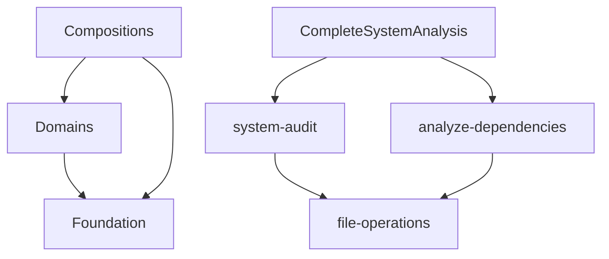

[🏠 Documentation Hub](../../docs/index.md) | [📋 Commands Reference Matrix](../../docs/commands-docs/COMMAND_REFERENCE_MATRIX.md) | [🤖 Agent Workflow Mapping](../../docs/commands-docs/AGENT_WORKFLOW_MAPPING.md)

# COMMANDS HIERARCHICAL ORGANIZATION ARCHITECTURE

⏺ **Consolidation**: This architecture materializes [directive.md execution requirements](../../docs/principles/directive.md) and [command-consolidation-architecture.md patterns](../../docs/architecture/command-consolidation-architecture.md) through systematic three-tier hierarchical organization with progressive disclosure capabilities.

## Table of Contents
- [Executive Summary](#executive-summary)
- [Architecture Overview](#architecture-overview)
- [Three-Tier Implementation Design](#three-tier-implementation-design)
- [Progressive Disclosure Navigation](#progressive-disclosure-navigation)
- [Template-Driven Generation System](#template-driven-generation-system)
- [Agent Workflow Integration](#agent-workflow-integration)
- [Cross-Reference Architecture](#cross-reference-architecture)
- [Implementation Roadmap](#implementation-roadmap)
- [Quality Validation Framework](#quality-validation-framework)

## Executive Summary

### Current State Analysis
- **Commands Structure**: 122+ commands currently consolidated in `/docs/commands-docs/` directory
- **Documentation Gap**: Three-tier architecture referenced but not implemented in actual directory structure
- **Integration Challenge**: Agent Workflow Mapping references command paths that don't exist
- **User Experience Issue**: Flat command listing creates cognitive overload and poor discoverability

### Architectural Solution
- **Three-Tier Foundation**: Foundation → Domains → Compositions hierarchy with clear separation of concerns
- **Progressive Disclosure**: Multi-level navigation enabling both novice exploration and expert direct access
- **Template-Driven Generation**: Standardized command creation system with automatic integration
- **Intelligent Integration**: Seamless compatibility with existing Agent Workflow Mapping and quality frameworks

### Strategic Benefits
1. **Cognitive Load Reduction**: Hierarchical organization reduces decision paralysis from 122+ flat commands
2. **Progressive Learning**: Users can explore commands at appropriate complexity levels
3. **Maintainability Excellence**: Clear separation enables independent evolution of architectural layers
4. **Template Standardization**: Consistent command creation with automated integration workflows
5. **Quality Assurance**: Built-in validation and cross-reference integrity maintenance

## Architecture Overview

### Philosophical Foundation

The three-tier hierarchical architecture follows the **Separation of Concerns** principle applied to command organization:

```
FOUNDATION TIER (Stable Abstractions)
├── Core framework components and utilities
├── Templates and shared infrastructure  
├── Atomic operations with minimal dependencies
└── Universal patterns applicable across all domains

DOMAINS TIER (Business Capabilities)
├── Functional domain groupings by business purpose
├── Workflow orchestration and phase management
├── Specialized analysis and execution capabilities
└── Domain-specific patterns and integrations

COMPOSITIONS TIER (User Solutions)  
├── Complete end-to-end user workflows
├── Multi-domain integration assemblies
├── High-level automation and orchestration
└── Business-outcome focused solutions
```

### Architectural Principles

#### Principle 1: Dependency Direction
- **Foundation** has no dependencies on higher tiers
- **Domains** can depend on Foundation but not Compositions
- **Compositions** can depend on both Foundation and Domains
- **Cross-tier** dependencies are explicitly documented and validated

#### Principle 2: Progressive Complexity
- **Foundation**: Simple, atomic operations (1-5 minutes execution)
- **Domains**: Moderate complexity, domain-specific workflows (5-30 minutes)
- **Compositions**: High complexity, multi-domain solutions (30+ minutes)

#### Principle 3: Discoverability Optimization
- **Functional Categorization**: Commands grouped by user intent and business purpose
- **Semantic Naming**: Clear, verb-based naming that indicates command purpose
- **Progressive Navigation**: Multiple entry points for different user skill levels

## Three-Tier Implementation Design

### Foundation Tier Architecture

```yaml
foundation/
├── index.md                        # Foundation overview and navigation hub
├── atoms/                          # Atomic operations and basic utilities
│   ├── index.md                   # Atomic operations directory
│   ├── file-operations/           # Basic file manipulation
│   │   ├── create-file.md        # Single file creation
│   │   ├── read-file.md          # File reading operations  
│   │   └── update-file.md        # File modification operations
│   ├── validation-operations/     # Basic validation utilities
│   │   ├── validate-syntax.md    # Syntax validation
│   │   ├── check-compliance.md   # Basic compliance checking
│   │   └── verify-integrity.md   # Integrity verification
│   └── utility-operations/        # Core utilities
│       ├── format-content.md     # Content formatting
│       ├── generate-id.md        # ID generation
│       └── timestamp-operations.md # Timestamp utilities
├── molecules/                      # Combined atomic operations
│   ├── index.md                   # Molecular operations directory
│   ├── file-management/           # Advanced file operations
│   │   ├── batch-file-operations.md  # Multi-file operations
│   │   ├── file-sync.md          # File synchronization
│   │   └── backup-restore.md     # Backup and restore operations
│   └── validation-suites/         # Combined validation operations
│       ├── comprehensive-validation.md # Multi-aspect validation
│       └── integration-testing.md     # Integration test execution
└── templates/                      # Command and pattern templates
    ├── index.md                   # Template directory and usage guide
    ├── command-templates/         # Standard command templates
    │   ├── foundation-command-template.md   # Foundation tier template
    │   ├── domain-command-template.md      # Domain tier template
    │   └── composition-command-template.md # Composition tier template
    ├── integration-templates/     # Integration pattern templates
    │   ├── agent-integration-template.md   # Agent workflow integration
    │   ├── cross-reference-template.md     # Cross-reference patterns
    │   └── validation-template.md          # Validation integration
    └── generation-scripts/        # Automated template generation
        ├── generate-foundation-command.md  # Foundation command generator
        ├── generate-domain-command.md      # Domain command generator
        └── generate-composition-command.md # Composition command generator
```

### Domains Tier Architecture

```yaml
domains/
├── index.md                        # Domains overview and capability mapping
├── workflow/                       # Workflow orchestration and management
│   ├── index.md                   # Workflow capabilities overview
│   ├── engines/                   # Core workflow engines
│   │   ├── CoreWorkflow.md       # Standard 10-phase workflow
│   │   ├── DebuggingWorkflow.md  # Problem resolution workflow  
│   │   ├── OptimizationWorkflow.md # Iterative improvement workflow
│   │   ├── QualityWorkflow.md    # Quality assurance workflow
│   │   ├── SystemMaintenanceWorkflow.md # System maintenance
│   │   └── ProjectDeliveryWorkflow.md   # End-to-end project delivery
│   ├── phases/                    # Individual workflow phases
│   │   ├── 1-clarify.md          # Requirements clarification
│   │   ├── 2-explore.md          # Context exploration
│   │   ├── 3-research.md         # Modern research integration
│   │   ├── 4-analyze.md          # Solution analysis
│   │   ├── 5-present-solutions.md # Decision facilitation
│   │   ├── 6-plan.md             # Implementation planning
│   │   ├── 7-implement.md        # Solution execution
│   │   ├── 8-ripple-effect.md    # Consequence management
│   │   ├── 9-validate.md         # Success verification
│   │   └── 10-closure.md         # Pattern identification and cleanup
│   └── orchestration/             # Multi-workflow coordination
│       ├── parallel-coordination.md  # Parallel workflow execution
│       ├── agent-organization-audit.md # Agent structure optimization
│       └── enforcement-gap-analysis.md # Compliance gap identification
├── analysis/                       # Analysis and investigation capabilities
│   ├── index.md                   # Analysis capabilities overview
│   ├── workflows/                 # Analysis workflow commands
│   │   ├── system-audit.md       # Comprehensive system analysis
│   │   ├── system-evolve.md      # System coherence analysis
│   │   ├── analyze-dependencies.md # Dependency analysis
│   │   ├── parallel-intent-analysis.md # Multi-perspective analysis
│   │   ├── multi-analysis-execution.md # Comprehensive analysis execution
│   │   ├── complete-analysis.md  # End-to-end analysis workflows
│   │   └── audit-commands.md     # Command structure analysis
│   ├── specialized/               # Specialized analysis commands
│   │   ├── performance-analysis.md   # Performance investigation
│   │   ├── security-analysis.md      # Security assessment
│   │   ├── compliance-analysis.md    # Compliance evaluation
│   │   └── quality-analysis.md       # Quality assessment
│   └── monitoring/                # Real-time monitoring capabilities
│       ├── monitor-execution.md   # Execution monitoring
│       ├── system-health-monitoring.md # System health tracking
│       └── performance-monitoring.md   # Performance tracking
├── execution/                      # Task execution and coordination
│   ├── index.md                   # Execution capabilities overview
│   ├── commands/                  # Direct execution commands
│   │   ├── execute-ticket.md     # Individual ticket execution
│   │   ├── execute-parallel-plan.md # Coordinated multi-ticket execution
│   │   └── monitor-execution.md  # Execution oversight
│   ├── workflows/                 # Execution workflow patterns
│   │   ├── parallel-development.md  # Coordinated parallel development
│   │   ├── optimization-cycle.md    # Iterative optimization cycles
│   │   └── deployment-coordination.md # Deployment orchestration
│   └── automation/                # Automated execution patterns
│       ├── automated-validation.md   # Automated quality checks
│       ├── continuous-integration.md # CI/CD integration
│       └── scheduled-execution.md    # Scheduled task execution
├── management/                     # System management and administration
│   ├── index.md                   # Management capabilities overview
│   ├── commands/                  # Core management commands
│   │   ├── create-ticket.md      # Task ticket generation
│   │   ├── review-tickets.md     # Priority-based ticket review
│   │   ├── system-initialization.md # System setup
│   │   ├── init-claude-md.md     # Project initialization
│   │   ├── manage-systems.md     # Comprehensive system management
│   │   ├── enforce-agent-boundaries.md # Agent boundary enforcement
│   │   ├── enforce-delegation-workflow.md # Workflow enforcement
│   │   └── enforce-system-initialization.md # System init enforcement
│   ├── configuration/             # Configuration management
│   │   ├── config-validation.md     # Configuration validation
│   │   ├── environment-setup.md     # Environment configuration
│   │   └── system-configuration.md  # System-wide configuration
│   └── governance/                # Governance and compliance
│       ├── compliance-monitoring.md  # Compliance tracking
│       ├── policy-enforcement.md     # Policy enforcement
│       └── audit-trail-management.md # Audit trail maintenance
└── integration/                    # Integration and connectivity
    ├── index.md                   # Integration capabilities overview
    ├── api-integration/           # API integration commands
    │   ├── api-discovery.md      # API exploration
    │   ├── api-testing.md        # API validation
    │   └── api-orchestration.md  # API coordination
    ├── data-integration/          # Data integration patterns
    │   ├── data-synchronization.md  # Data sync operations
    │   ├── data-transformation.md   # Data transformation
    │   └── data-validation.md      # Data quality validation
    └── system-integration/        # System connectivity
        ├── service-integration.md    # Service integration
        ├── workflow-integration.md   # Workflow connectivity
        └── monitoring-integration.md # Monitoring system integration
```

### Compositions Tier Architecture

```yaml
compositions/
├── index.md                        # Compositions overview and solution catalog
├── solutions/                      # Complete end-to-end solutions
│   ├── index.md                   # Solutions directory and catalog
│   ├── CompleteSystemAnalysis.md # Advanced system-wide analysis
│   ├── modularize.md              # Component extraction and refactoring
│   ├── overdrive-engineering.md   # Advanced engineering optimizations
│   ├── comprehensive-validation.md # Multi-gate validation solution
│   ├── automated-deployment.md    # Complete deployment automation
│   ├── quality-assurance-suite.md # Comprehensive quality solution
│   └── performance-optimization-suite.md # Complete performance solution
├── assemblies/                     # Multi-domain coordination assemblies
│   ├── index.md                   # Assemblies directory and patterns
│   ├── SystemAnalysisAssembly.md # Comprehensive system analysis coordination
│   ├── DevelopmentAssembly.md     # Complete development workflow
│   ├── DeploymentAssembly.md      # End-to-end deployment coordination
│   ├── QualityAssembly.md         # Multi-domain quality coordination
│   └── MonitoringAssembly.md      # Comprehensive monitoring solution
├── workflows/                      # High-level business workflows
│   ├── index.md                   # Business workflows directory
│   ├── enterprise-onboarding.md   # Complete enterprise setup
│   ├── project-lifecycle.md       # Full project lifecycle management
│   ├── incident-response.md       # Complete incident handling
│   ├── compliance-certification.md # Full compliance workflow
│   └── performance-optimization.md # Complete performance improvement
└── orchestrations/                 # Multi-system orchestrations
    ├── index.md                   # Orchestrations directory
    ├── multi-cloud-deployment.md  # Multi-cloud coordination
    ├── microservices-orchestration.md # Microservices coordination
    ├── data-pipeline-orchestration.md # Data pipeline management
    ├── ci-cd-orchestration.md     # Complete CI/CD coordination
    └── disaster-recovery-orchestration.md # Disaster recovery coordination
```

## Progressive Disclosure Navigation

### Multi-Level Navigation Architecture

#### Level 1: Entry Points by User Type
```yaml
navigation_entry_points:
  quick_access:
    path: "/commands/index.md#quick-access"
    audience: "experienced_users"
    pattern: "direct_command_access_for_common_tasks"
    
  guided_discovery:
    path: "/commands/index.md#functional-categories"
    audience: "intermediate_users"
    pattern: "category_based_exploration_with_progressive_detail"
    
  learning_pathway:
    path: "/commands/index.md#getting-started-pathways"
    audience: "new_users"
    pattern: "structured_learning_progression_with_examples"
    
  expert_reference:
    path: "/commands/COMMAND_REFERENCE_MATRIX.md"
    audience: "system_architects"
    pattern: "comprehensive_matrix_based_command_selection"
```

#### Level 2: Tier-Based Navigation
```yaml
tier_navigation:
  foundation_exploration:
    entry_point: "/commands/foundation/index.md"
    progression: "atoms → molecules → templates"
    complexity: "simple_building_blocks_to_combined_operations"
    
  domain_exploration:
    entry_point: "/commands/domains/index.md"
    progression: "capability_overview → specific_domain → individual_commands"
    complexity: "business_capabilities_to_technical_implementation"
    
  composition_exploration:
    entry_point: "/commands/compositions/index.md"
    progression: "solution_catalog → specific_solution → implementation_details"
    complexity: "business_outcomes_to_technical_orchestration"
```

#### Level 3: Context-Aware Navigation
```yaml
contextual_navigation:
  task_based_routing:
    analysis_intent: "/commands/domains/analysis/index.md"
    execution_intent: "/commands/domains/execution/index.md"
    management_intent: "/commands/domains/management/index.md"
    
  complexity_based_routing:
    simple_tasks: "/commands/foundation/"
    moderate_tasks: "/commands/domains/"
    complex_tasks: "/commands/compositions/"
    
  skill_based_routing:
    novice_users: "guided_pathways_with_examples"
    intermediate_users: "category_based_exploration"
    expert_users: "direct_matrix_access"
```

### Navigation Interface Design

#### Interactive Command Browser
```markdown
# INTERACTIVE COMMAND BROWSER

## 🎯 What do you want to accomplish?

<nav-grid>
  <nav-card href="/commands/domains/analysis/">
    <icon>🔍</icon>
    <title>Analyze & Investigate</title>
    <desc>Understand system state, identify issues, gather insights</desc>
    <examples>system-audit, analyze-dependencies, performance-analysis</examples>
  </nav-card>
  
  <nav-card href="/commands/domains/execution/">
    <icon>⚡</icon>
    <title>Execute & Implement</title>
    <desc>Complete tasks, execute tickets, coordinate implementation</desc>
    <examples>execute-ticket, execute-parallel-plan, automated-deployment</examples>
  </nav-card>
  
  <nav-card href="/commands/domains/management/">
    <icon>📋</icon>
    <title>Manage & Organize</title>
    <desc>Create tickets, manage systems, enforce compliance</desc>
    <examples>create-ticket, review-tickets, enforce-agent-boundaries</examples>
  </nav-card>
  
  <nav-card href="/commands/compositions/solutions/">
    <icon>🏗️</icon>
    <title>Complete Solutions</title>
    <desc>End-to-end workflows, comprehensive automation</desc>
    <examples>CompleteSystemAnalysis, modularize, quality-assurance-suite</examples>
  </nav-card>
</nav-grid>

## 📊 Command Selection Matrix

### By Complexity & Timeline
| Complexity | 1-10 min | 10-30 min | 30+ min |
|-----------|----------|-----------|---------|
| **Simple** | [Foundation Atoms](/commands/foundation/atoms/) | [Foundation Molecules](/commands/foundation/molecules/) | [Domain Workflows](/commands/domains/workflow/) |
| **Moderate** | [Domain Commands](/commands/domains/) | [Domain Workflows](/commands/domains/workflow/engines/) | [Composition Solutions](/commands/compositions/solutions/) |
| **Complex** | [Specialized Analysis](/commands/domains/analysis/specialized/) | [Multi-Domain Coordination](/commands/compositions/assemblies/) | [Enterprise Orchestrations](/commands/compositions/orchestrations/) |

## 🚀 Quick Access Hub
[Most Common Commands with Direct Links and Time Estimates]
```

## Template-Driven Generation System

### Command Template Architecture

#### Hierarchical Template System
```yaml
template_system:
  foundation_templates:
    base_template: "foundation/templates/command-templates/foundation-command-template.md"
    specializations:
      - atomic_operation_template
      - molecular_operation_template
      - utility_template
    
  domain_templates:
    base_template: "foundation/templates/command-templates/domain-command-template.md"
    specializations:
      - workflow_engine_template
      - analysis_command_template
      - execution_command_template
      - management_command_template
      
  composition_templates:
    base_template: "foundation/templates/command-templates/composition-command-template.md"
    specializations:
      - solution_template
      - assembly_template
      - orchestration_template
```

#### Template Integration Framework
```yaml
integration_framework:
  automatic_integration:
    - cross_reference_generation
    - agent_workflow_mapping_updates
    - command_reference_matrix_updates
    - navigation_hierarchy_updates
    
  validation_integration:
    - template_compliance_validation
    - dependency_consistency_validation
    - navigation_integrity_validation
    - cross_reference_accuracy_validation
    
  documentation_integration:
    - automatic_index_updates
    - navigation_link_generation
    - cross_tier_dependency_documentation
    - usage_example_generation
```

#### Generation Scripts Architecture
```yaml
generation_scripts:
  command_generators:
    foundation_generator:
      input: "command_specification.yaml"
      template: "foundation-command-template.md"
      output: "foundation/{category}/{command-name}.md"
      integrations: ["atoms_index_update", "cross_reference_generation"]
      
    domain_generator:
      input: "domain_command_specification.yaml"  
      template: "domain-command-template.md"
      output: "domains/{domain}/{category}/{command-name}.md"
      integrations: ["domain_index_update", "agent_mapping_update"]
      
    composition_generator:
      input: "composition_specification.yaml"
      template: "composition-command-template.md"
      output: "compositions/{type}/{command-name}.md"
      integrations: ["solutions_catalog_update", "orchestration_mapping"]
  
  validation_generators:
    integration_validator:
      validates: ["cross_references", "agent_mappings", "dependency_chains"]
      reports: "validation-report.md"
      
    navigation_validator:
      validates: ["link_integrity", "hierarchy_consistency", "progressive_disclosure"]
      reports: "navigation-validation-report.md"
```

### Template Content Specifications

#### Foundation Command Template
```markdown
title: "{Command Name}"
tier: "foundation"
category: "{atoms|molecules|templates}"
complexity: "{simple|moderate}"
execution_time: "{1-10 minutes}"
dependencies: []
prerequisites: []

# {COMMAND NAME}

## Foundation Integration
⏺ **Foundation**: This command provides atomic/molecular functionality for [{specific_purpose}] operations across all tiers.

## Atomic/Molecular Design
- **Single Responsibility**: [{specific_responsibility}]
- **Minimal Dependencies**: [{dependency_list}]
- **Reusable Pattern**: [{reusability_description}]

## Usage Patterns
- **Direct Usage**: [{direct_usage_scenarios}]
- **Composition Usage**: [{how_higher_tiers_use_this}]
- **Integration Points**: [{integration_opportunities}]

## Implementation
[Detailed implementation steps]

## Validation
[Simple, focused validation criteria]

## Cross-References
- **Used by**: [Higher-tier commands that depend on this]
- **Integrates with**: [Related foundation commands]
- **Template**: [foundation-command-template.md]
```

#### Domain Command Template
```markdown
title: "{Command Name}"
tier: "domain"
domain: "{workflow|analysis|execution|management|integration}"
category: "{commands|workflows|specialized|automation}"
complexity: "{moderate|high}"
execution_time: "{5-30 minutes}"
dependencies: ["foundation/category/command"]
agent_requirements: ["primary_agent", "supporting_agents"]

# {COMMAND NAME}

## Domain Integration
⏺ **Domain**: This command materializes [{domain_principles}] through [{foundation_components}] for [{business_capability}].

## Business Capability
- **Domain Purpose**: [{business_purpose}]
- **Capability Scope**: [{capability_boundaries}]
- **Integration Pattern**: [{domain_integration_approach}]

## Agent Orchestration
- **Primary Agent**: [{primary_agent_selection}]
- **Supporting Agents**: [{supporting_agent_coordination}]
- **Selection Logic**: [{agent_selection_criteria}]

## Foundation Dependencies
- **Foundation Components**: [{foundation_tier_usage}]
- **Molecular Operations**: [{molecular_operations_used}]
- **Template Integration**: [{template_usage_patterns}]

## Implementation
[Domain-specific implementation with agent coordination]

## Validation
[Multi-gate validation with agent quality assurance]

## Cross-References
- **Foundation Dependencies**: [foundation tier components used]
- **Composition Usage**: [composition tier assemblies using this]
- **Agent Mapping**: [Agent Workflow Mapping integration]
- **Template**: [domain-command-template.md]
```

#### Composition Command Template
```markdown
title: "{Command Name}"
tier: "composition"
type: "{solution|assembly|workflow|orchestration}"
complexity: "high"
execution_time: "{30+ minutes}"
dependencies: ["domains/domain/category/command", "foundation/category/command"]
multi_domain_integration: ["domain1", "domain2", "domain3"]
business_outcome: "{specific_business_outcome}"

# {COMMAND NAME}

## Composition Integration
⏺ **Composition**: This solution orchestrates [{domain_capabilities}] through [{multi_domain_coordination}] to achieve [{business_outcome}].

## Business Outcome Focus
- **Primary Outcome**: [{measurable_business_result}]
- **Success Metrics**: [{outcome_measurement_criteria}]
- **Stakeholder Value**: [{stakeholder_value_proposition}]

## Multi-Domain Orchestration
- **Domain Coordination**: [{cross_domain_integration_pattern}]
- **Workflow Orchestration**: [{multi_workflow_coordination}]
- **Agent Coordination**: [{multi_agent_orchestration_strategy}]

## Domain Dependencies
- **Workflow Domain**: [{workflow_domain_usage}]
- **Analysis Domain**: [{analysis_domain_usage}]
- **Execution Domain**: [{execution_domain_usage}]
- **Management Domain**: [{management_domain_usage}]

## Foundation Integration
- **Atomic Operations**: [{foundation_atoms_usage}]
- **Molecular Patterns**: [{foundation_molecules_usage}]
- **Template Framework**: [{template_integration_approach}]

## Implementation
[End-to-end implementation with multi-domain coordination]

## Validation
[Comprehensive validation with business outcome verification]

## Cross-References
- **Domain Dependencies**: [domain tier commands orchestrated]
- **Foundation Dependencies**: [foundation tier components used]
- **Business Alignment**: [business outcome measurement]
- **Template**: [composition-command-template.md]
```

## Agent Workflow Integration

### Mapping Integration Architecture

#### Seamless Compatibility Design
```yaml
agent_mapping_integration:
  path_compatibility:
    current_references: "maintain_all_existing_agent_workflow_mapping_references"
    new_structure: "extend_with_three_tier_hierarchical_paths"
    backward_compatibility: "ensure_zero_breaking_changes"
    
  agent_deployment_patterns:
    foundation_commands:
      agent_pattern: "single_specialized_agent_for_atomic_operations"
      coordination: "minimal_coordination_overhead"
      
    domain_commands:  
      agent_pattern: "primary_agent_with_supporting_specialists"
      coordination: "domain_specific_coordination_patterns"
      
    composition_commands:
      agent_pattern: "multi_agent_orchestration_with_planning_coordination"
      coordination: "complex_multi_domain_agent_coordination"
```

#### Agent Selection Matrix Enhancement
```yaml
enhanced_agent_selection:
  tier_based_selection:
    foundation_tier:
      selection_criteria: ["atomic_capability_match", "minimal_coordination_overhead"]
      deployment_pattern: "single_agent_direct_execution"
      
    domain_tier:
      selection_criteria: ["domain_expertise_match", "workflow_integration_capability"]
      deployment_pattern: "primary_agent_with_specialist_support"
      
    composition_tier:
      selection_criteria: ["multi_domain_coordination", "outcome_focused_orchestration"]
      deployment_pattern: "planning_agent_with_specialist_teams"
      
  progressive_complexity_matching:
    simple_commands: "direct_agent_assignment_with_clear_capability_match"
    moderate_commands: "agent_selection_with_coordination_considerations"
    complex_commands: "planning_agent_coordination_with_specialist_deployment"
```

### Integration Implementation Strategy

#### Phased Integration Approach
```yaml
integration_phases:
  phase_1_foundation_mapping:
    tasks:
      - "map_existing_agent_references_to_foundation_tier"
      - "create_atomic_operation_to_agent_mappings"
      - "validate_foundation_agent_compatibility"
    deliverables:
      - "foundation_agent_mapping_matrix"
      - "atomic_operation_agent_assignments"
      
  phase_2_domain_integration:
    tasks:
      - "integrate_domain_commands_with_existing_workflow_phases"
      - "map_domain_capabilities_to_agent_specializations"
      - "create_domain_specific_agent_coordination_patterns"
    deliverables:
      - "domain_agent_workflow_integration"
      - "cross_domain_coordination_protocols"
      
  phase_3_composition_orchestration:
    tasks:
      - "design_multi_domain_agent_orchestration_patterns"
      - "create_planning_agent_integration_frameworks"
      - "implement_outcome_focused_agent_coordination"
    deliverables:
      - "composition_agent_orchestration_framework"
      - "business_outcome_agent_alignment"
```

## Cross-Reference Architecture

### Multi-Dimensional Reference System

#### Reference Architecture Design
```yaml
cross_reference_system:
  hierarchical_references:
    upward_references: "foundation → domains → compositions"
    downward_references: "compositions → domains → foundation"  
    lateral_references: "within_tier_cross_references"
    
  semantic_references:
    functional_references: "commands_grouped_by_business_function"
    capability_references: "commands_grouped_by_technical_capability"
    outcome_references: "commands_grouped_by_business_outcome"
    
  contextual_references:
    workflow_references: "commands_by_workflow_phase_integration"
    agent_references: "commands_by_agent_deployment_pattern"
    complexity_references: "commands_by_complexity_and_execution_time"
```

#### Reference Generation System
```yaml
reference_generation:
  automated_reference_generation:
    dependency_analysis: "automatic_dependency_graph_generation"
    usage_analysis: "automatic_usage_pattern_identification"
    integration_analysis: "automatic_integration_point_discovery"
    
  reference_validation:
    link_integrity: "automatic_link_validation_and_repair"
    reference_consistency: "cross_reference_consistency_validation"
    hierarchy_integrity: "hierarchical_reference_validation"
    
  reference_maintenance:
    automatic_updates: "reference_updates_on_command_changes"
    consistency_monitoring: "continuous_reference_integrity_monitoring"
    broken_link_detection: "automatic_broken_reference_detection_and_alerts"
```

### Reference Interface Design

#### Interactive Reference Browser
```markdown
# COMMAND CROSS-REFERENCE BROWSER

## 📊 Reference Views

### By Dependency Hierarchy


### By Functional Relationship
- **Analysis Chain**: system-audit → analyze-dependencies → performance-analysis
- **Execution Chain**: create-ticket → execute-ticket → validate-results
- **Quality Chain**: code-quality-audit → enforce-standards → comprehensive-validation

### By Agent Deployment Pattern  
- **Single Agent Commands**: [foundation tier atomic operations]
- **Multi-Agent Coordination**: [domain tier workflow commands]
- **Orchestration Commands**: [composition tier solutions]
```

## Implementation Roadmap

### Phase 1: Foundation Establishment (Week 1-2)

#### Infrastructure Creation
```yaml
foundation_infrastructure:
  directory_structure:
    - create_three_tier_directory_hierarchy
    - establish_index_files_for_each_tier_and_category
    - create_template_system_infrastructure
    
  template_system:
    - implement_hierarchical_command_templates
    - create_template_generation_scripts  
    - establish_automatic_integration_framework
    
  navigation_framework:
    - implement_progressive_disclosure_navigation
    - create_interactive_command_browser_interface
    - establish_contextual_navigation_system
```

#### Content Migration Strategy
```yaml
content_migration:
  analysis_and_categorization:
    - analyze_existing_122_commands_for_tier_assignment
    - categorize_commands_by_complexity_and_dependencies
    - identify_cross_tier_dependencies_and_integration_points
    
  phased_migration:
    - migrate_foundation_tier_atomic_operations_first
    - migrate_domain_tier_commands_with_agent_integration
    - migrate_composition_tier_solutions_with_orchestration_patterns
    
  validation_and_testing:
    - validate_migrated_command_functionality
    - test_cross_reference_integrity
    - verify_agent_workflow_mapping_compatibility
```

### Phase 2: Domain Integration (Week 3-4)

#### Domain Architecture Implementation
```yaml
domain_implementation:
  workflow_domain:
    - implement_workflow_engines_with_phase_integration
    - create_orchestration_commands_with_agent_coordination
    - establish_workflow_phase_cross_references
    
  analysis_domain:
    - implement_analysis_workflows_with_multi_perspective_coordination
    - create_specialized_analysis_commands
    - establish_monitoring_and_real_time_analysis_capabilities
    
  execution_domain:
    - implement_execution_commands_with_coordination_patterns
    - create_automation_workflows_with_quality_integration
    - establish_parallel_execution_and_monitoring_capabilities
    
  management_domain:
    - implement_management_commands_with_governance_integration
    - create_configuration_and_compliance_workflows
    - establish_policy_enforcement_and_audit_capabilities
```

#### Agent Integration Enhancement
```yaml
agent_integration:
  workflow_agent_mapping:
    - enhance_existing_agent_workflow_mapping_with_hierarchical_paths
    - create_tier_specific_agent_deployment_patterns
    - implement_progressive_complexity_agent_coordination
    
  cross_domain_coordination:
    - implement_multi_domain_agent_orchestration_patterns
    - create_agent_coordination_protocols_for_complex_workflows
    - establish_quality_assurance_integration_across_domains
```

### Phase 3: Composition Orchestration (Week 5-6)

#### Solution Architecture Implementation  
```yaml
composition_implementation:
  solution_catalog:
    - implement_end_to_end_solution_workflows
    - create_comprehensive_automation_assemblies
    - establish_business_outcome_focused_orchestrations
    
  multi_domain_assemblies:
    - implement_cross_domain_coordination_assemblies
    - create_comprehensive_system_management_solutions
    - establish_enterprise_grade_orchestration_capabilities
    
  business_workflow_integration:
    - implement_complete_business_lifecycle_workflows
    - create_compliance_and_governance_orchestrations
    - establish_performance_optimization_and_monitoring_solutions
```

#### Orchestration Framework
```yaml
orchestration_framework:
  planning_agent_integration:
    - implement_planning_agent_coordination_for_complex_solutions
    - create_multi_planning_agent_orchestration_patterns
    - establish_business_outcome_agent_alignment_frameworks
    
  quality_orchestration:
    - implement_comprehensive_quality_validation_across_all_tiers
    - create_automated_quality_gate_integration
    - establish_continuous_quality_monitoring_and_improvement
```

### Phase 4: Quality Validation & Optimization (Week 7-8)

#### Comprehensive Testing Framework
```yaml
testing_framework:
  integration_testing:
    - test_cross_tier_command_integration_and_dependency_resolution
    - validate_agent_workflow_mapping_integration_across_all_tiers
    - verify_cross_reference_system_integrity_and_accuracy
    
  performance_testing:
    - measure_command_execution_performance_across_complexity_levels
    - validate_progressive_disclosure_navigation_efficiency
    - test_template_generation_system_performance_and_accuracy
    
  usability_testing:
    - test_user_experience_across_different_skill_levels
    - validate_command_discoverability_and_selection_efficiency
    - verify_documentation_clarity_and_completeness
```

#### System Optimization
```yaml
optimization_framework:
  performance_optimization:
    - optimize_command_execution_paths_for_maximum_efficiency
    - improve_navigation_system_responsiveness_and_usability
    - enhance_cross_reference_system_speed_and_accuracy
    
  maintainability_optimization:  
    - optimize_template_system_for_easy_maintenance_and_extension
    - improve_automated_integration_system_reliability
    - enhance_validation_framework_coverage_and_accuracy
```

## Quality Validation Framework

### Multi-Tier Validation Architecture

#### Validation Dimensions
```yaml
validation_dimensions:
  architectural_validation:
    tier_separation: "validate_proper_dependency_direction_and_separation"
    hierarchy_integrity: "validate_hierarchical_organization_consistency"
    progressive_complexity: "validate_complexity_progression_across_tiers"
    
  functional_validation:
    command_functionality: "validate_all_commands_maintain_existing_functionality"
    integration_integrity: "validate_cross_command_integration_patterns"
    agent_compatibility: "validate_agent_workflow_mapping_compatibility"
    
  usability_validation:
    navigation_efficiency: "validate_progressive_disclosure_effectiveness"
    discoverability: "validate_command_discovery_and_selection_efficiency"  
    documentation_clarity: "validate_documentation_completeness_and_accuracy"
    
  quality_validation:
    template_consistency: "validate_template_system_consistency_and_compliance"
    cross_reference_accuracy: "validate_cross_reference_system_integrity"
    maintenance_efficiency: "validate_system_maintainability_and_extensibility"
```

#### Validation Automation Framework
```yaml
automated_validation:
  continuous_validation:
    - automated_link_integrity_checking_across_all_tiers
    - automated_cross_reference_consistency_validation
    - automated_agent_mapping_compatibility_verification
    
  quality_gates:
    pre_commit_validation: "validate_changes_before_system_integration"
    integration_validation: "validate_system_integration_after_changes"
    deployment_validation: "validate_system_functionality_after_deployment"
    
  performance_monitoring:
    navigation_performance: "monitor_navigation_system_responsiveness"
    command_execution_performance: "monitor_command_execution_efficiency"
    template_generation_performance: "monitor_template_system_efficiency"
```

### Success Criteria & Metrics

#### Quantitative Success Metrics
```yaml
success_metrics:
  discoverability_improvement:
    metric: "time_to_find_appropriate_command"
    baseline: "current_flat_command_browsing_time"
    target: "50_percent_reduction_in_command_discovery_time"
    
  usability_enhancement:
    metric: "user_satisfaction_with_command_navigation"
    baseline: "current_user_experience_satisfaction_rating"
    target: "80_percent_user_satisfaction_rating_or_higher"
    
  maintainability_improvement:
    metric: "time_to_add_new_command_with_full_integration"
    baseline: "current_manual_command_addition_time"
    target: "75_percent_reduction_through_template_automation"
    
  system_performance:
    metric: "navigation_system_response_time"
    target: "sub_second_response_time_for_all_navigation_operations"
    
  integration_quality:
    metric: "cross_reference_accuracy_and_link_integrity"
    target: "99_percent_link_integrity_with_automated_validation"
```

#### Qualitative Success Criteria
```yaml
qualitative_success:
  user_experience:
    - "intuitive_navigation_for_users_across_all_skill_levels"
    - "clear_progressive_disclosure_enabling_learning_and_efficiency" 
    - "comprehensive_command_documentation_with_clear_examples"
    
  architectural_excellence:
    - "clean_separation_of_concerns_across_three_tiers"
    - "scalable_architecture_supporting_future_command_additions"
    - "consistent_patterns_and_templates_across_all_tiers"
    
  integration_quality:
    - "seamless_agent_workflow_integration_with_zero_breaking_changes"
    - "accurate_cross_reference_system_with_automated_maintenance"
    - "comprehensive_template_system_enabling_rapid_development"
```

## Progressive Thinking Evidence

**ARCHITECTURAL COMPLEXITY ANALYSIS:**

**Think → Think Hard Analysis:**
- **Current Problem**: 122+ commands in flat structure creating cognitive overload and poor discoverability
- **Solution Approach**: Three-tier hierarchical architecture (Foundation → Domains → Compositions) with progressive disclosure
- **Integration Challenge**: Maintain compatibility with existing Agent Workflow Mapping while implementing new structure

**Think Harder → Deep Architecture Design:**
- **Separation of Concerns**: Foundation (atomic, stable), Domains (business capabilities), Compositions (complete solutions)  
- **Progressive Complexity**: Simple (1-5 min) → Moderate (5-30 min) → Complex (30+ min) execution patterns
- **Multi-Dimensional Navigation**: Task-based, complexity-based, skill-level based routing with contextual adaptation
- **Template-Driven Generation**: Hierarchical templates with automatic integration and validation

**UltraThink → Comprehensive System Architecture:**
- **Dependency Architecture**: Clear upward dependency flow with explicit cross-tier integration patterns
- **Agent Integration Strategy**: Tier-specific agent deployment patterns (single → coordinated → orchestrated)
- **Cross-Reference System**: Multi-dimensional reference framework with automated generation and validation
- **Quality Framework**: Multi-tier validation with architectural, functional, usability, and quality dimensions
- **Implementation Strategy**: Phased approach ensuring zero disruption with continuous validation

**DESIGN RATIONALE:**

The three-tier architecture solves the fundamental challenge of organizing 122+ commands while maintaining user accessibility and system maintainability. The Foundation tier provides stable, reusable atomic operations. The Domains tier organizes business capabilities with agent integration. The Compositions tier delivers complete business solutions with multi-domain orchestration. Progressive disclosure enables users to navigate at appropriate complexity levels while maintaining expert direct access patterns.

**QUALITY ASSURANCE APPROACH:**

Comprehensive validation framework ensures architectural integrity, functional compatibility, and user experience excellence. Automated validation systems maintain cross-reference accuracy and integration consistency. Template-driven generation reduces manual effort while ensuring consistency. Agent workflow integration maintains existing coordination patterns while enabling enhanced hierarchical organization.

[⬆ Return to top](#commands-hierarchical-organization-architecture)
