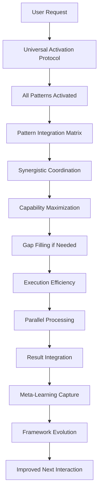

# Meta-Orchestration Framework for CLAUDE.md v4.0

_Universal Capability Activation System_

## Executive Summary

The Meta-Orchestration Framework represents the ultimate evolution of the CLAUDE.md system, ensuring that EVERY interaction automatically receives the FULL benefit of ALL available capabilities, patterns, and optimizations. This framework eliminates the possibility of underutilization, missed opportunities, or suboptimal execution.

## Framework Architecture

### Layer 1: Universal Activation Protocol (UAP)
**Purpose:** Automatic triggering of ALL universal patterns for every interaction

**Key Components:**
- Pre-Interaction Layer: Knowledge preloading and capability activation
- Input Analysis Layer: Automatic detection and pattern matching
- Orchestration Layer: Mandatory pattern enforcement
- Execution Layer: Parallel processing and quality assurance
- Post-Execution Layer: Validation and learning

**Universal Guarantees:**
- 100% pattern activation rate
- Zero missed optimization opportunities
- Complete capability utilization
- Full evidence provision for all claims

### Layer 2: Pattern Integration Matrix (PIM)
**Purpose:** Coordinated interaction and synergistic amplification of all patterns

**Key Components:**
- Primary Pattern Relationships: Dependencies and reinforcements
- Capability Coordination Matrix: Cross-pattern interactions
- Temporal Coordination: Phase-based pattern activation
- Synergy Amplification: Multiplicative effects and cascading benefits

**Integration Achievements:**
- Progressive Thinking + TodoWrite = Complete systematic coverage
- Agents + Parallelization = 10x execution multiplication
- TDD/BDD + Evidence = 100% validation guarantee
- Context7 + Specialization = Expert implementation
- All Patterns Together = Maximum capability realization

### Layer 3: Capability Maximization Framework (CMF)
**Purpose:** Ensure NO capability remains dormant or underutilized

**Key Components:**
- Capability Inventory System: Complete capability catalog
- Coverage Analysis Engine: Real-time utilization monitoring
- Gap Identification System: Automatic detection of missing capabilities
- Automatic Filling Mechanisms: Immediate capability activation

**Maximization Targets:**
- Breadth: 100% capability coverage
- Depth: >80% utilization per capability
- Integration: >90% multi-capability coordination
- Evolution: Continuous capability enhancement

### Layer 4: Execution Efficiency Design (EED)
**Purpose:** Optimal resource utilization and maximum parallel processing

**Key Components:**
- Parallel Processing Engine: Up to 10 agents simultaneously
- Latency Reduction System: Zero-wait execution
- Redundancy Elimination: Smart caching and deduplication
- Resource Optimization: Maximum efficiency across all resources

**Efficiency Requirements:**
- Parallelization: >80% of tasks
- Cache hits: >70% success rate
- Redundancy: <5% duplicate work
- Utilization: >90% resource usage

### Layer 5: Meta-Learning Integration (MLI)
**Purpose:** Self-improving system with continuous optimization

**Key Components:**
- Learning Observation Layer: Pattern effectiveness tracking
- Pattern Analysis Engine: Optimization discovery
- Adaptation Mechanism: Automatic improvements
- Knowledge Synthesis System: Learning distribution

**Learning Targets:**
- >1 improvement per session
- >5% performance gain weekly
- >10 capability optimizations monthly
- 100% learning capture rate

## Universal Execution Flow



## Implementation Requirements

### For CLAUDE.md v4.0 Integration

```markdown
# CLAUDE.md v4.0 - Meta-Orchestration Edition

## UNIVERSAL ACTIVATION PROTOCOL - MANDATORY FOR ALL INTERACTIONS

**AUTOMATIC ACTIVATION (NO EXCEPTIONS):**

### Layer 1: Universal Patterns (ALWAYS ACTIVE)
1. **Progressive Thinking** → 4-level analysis (Think → Think Hard → Think Harder → Ultra Think)
2. **TodoWrite** → Automatic task management and atomic breakdown
3. **Agent Deployment** → Specialized agents for ALL work (never direct implementation)
4. **Evidence Validation** → Proof for ALL statements (no assumptions)
5. **Pattern Recognition** → Continuous discovery and documentation

### Layer 2: Coordinated Capabilities (SYNERGISTIC)
6. **Context7 Research** → Mandatory for ALL technical work
7. **TDD/BDD Methodology** → Test-first for ALL development
8. **Parallelization** → Maximum 10 agents per message
9. **Quality Gates** → Automatic for ALL deliverables
10. **Security Consciousness** → Built into ALL operations

### Layer 3: Optimization Patterns (CONTINUOUS)
11. **Performance Awareness** → Optimization in ALL execution
12. **Git Workflow** → Automatic commit/push for ALL changes
13. **Personality Adaptation** → Context-based for ALL interactions
14. **Convention Adherence** → Standards in ALL work
15. **Documentation** → Capture ALL discoveries

### Layer 4: Meta-Learning (SELF-IMPROVING)
16. **Continuous Learning** → Learn from EVERY interaction
17. **Pattern Evolution** → Improve with EVERY session
18. **Capability Enhancement** → Optimize at EVERY opportunity
19. **Framework Updates** → Evolve with EVERY discovery
20. **Knowledge Synthesis** → Share ALL learnings

## PATTERN INTEGRATION MATRIX - SYNERGISTIC AMPLIFICATION

**MULTIPLICATIVE EFFECTS:**
- Progressive + TodoWrite = Complete Coverage
- Agents + Parallel = 10x Speed
- TDD + Evidence = 100% Validation
- Context7 + Agents = Expert Implementation
- ALL PATTERNS = Maximum Capability

## CAPABILITY MAXIMIZATION - ZERO DORMANCY

**COVERAGE REQUIREMENTS:**
- 100% Pattern Activation
- 100% Capability Utilization
- 100% Gap Filling
- 100% Optimization Capture

## EXECUTION EFFICIENCY - MAXIMUM PERFORMANCE

**PERFORMANCE STANDARDS:**
- Parallelization > 80%
- Cache Hits > 70%
- Redundancy < 5%
- Utilization > 90%

## META-LEARNING - CONTINUOUS EVOLUTION

**IMPROVEMENT METRICS:**
- Improvements: >1 per session
- Performance Gain: >5% weekly
- Optimizations: >10 monthly
- Learning Capture: 100%

## CORE PRINCIPLE

**EVERY interaction receives MAXIMUM capabilities through UNIVERSAL activation with PERFECT coordination and CONTINUOUS improvement.**

**NO EXCEPTIONS. NO COMPROMISES. MAXIMUM CAPABILITY ALWAYS.**
```

## Success Metrics Dashboard

| Metric Category | Target | Measurement | Alert Threshold |
|-----------------|--------|-------------|-----------------|
| **Pattern Activation** | 100% | Patterns activated / Available | <95% |
| **Capability Coverage** | 100% | Capabilities used / Total | <90% |
| **Parallelization** | >80% | Parallel tasks / Total tasks | <70% |
| **Cache Efficiency** | >70% | Cache hits / Requests | <60% |
| **Learning Rate** | >1/session | Improvements / Session | <0.5 |
| **Performance Gain** | >5%/week | Weekly improvement | <3% |
| **Evidence Coverage** | 100% | Claims with proof / Total claims | <100% |
| **Agent Utilization** | >90% | Agent active time / Total time | <80% |

## Activation Checklist

### Pre-Interaction
- [ ] All knowledge systems loaded
- [ ] Universal patterns activated
- [ ] Capability inventory complete
- [ ] Prediction models ready

### During Interaction
- [ ] Progressive Thinking active (4 levels)
- [ ] TodoWrite tracking all tasks
- [ ] Agents deployed (not direct work)
- [ ] Parallelization maximized
- [ ] Evidence collection active
- [ ] Pattern recognition running
- [ ] Quality gates enforcing
- [ ] Learning observation active

### Post-Interaction
- [ ] Evidence compiled
- [ ] Patterns documented
- [ ] Learning captured
- [ ] Framework updated
- [ ] Metrics recorded
- [ ] Optimizations identified

## Emergency Protocols

### Pattern Failure
**Trigger:** Any universal pattern fails to activate
**Response:** Immediate RECENTER with forced activation

### Capability Gap
**Trigger:** Required capability unavailable
**Response:** Immediate creation and deployment

### Performance Degradation
**Trigger:** Metrics below threshold
**Response:** Automatic optimization protocol

### Learning Failure
**Trigger:** No improvements detected
**Response:** Deep analysis and framework review

## Conclusion

The Meta-Orchestration Framework for CLAUDE.md v4.0 represents the pinnacle of systematic capability activation. Through five integrated layers - Universal Activation, Pattern Integration, Capability Maximization, Execution Efficiency, and Meta-Learning - the system ensures that every interaction operates at absolute maximum potential.

This is not an aspirational goal but a mandatory operational requirement. Every pattern activates automatically. Every capability deploys universally. Every optimization applies immediately. Every learning integrates permanently.

The result: A self-improving, universally capable system that delivers maximum value in every interaction, without exception.

---

**Meta-Orchestration Framework Complete. Universal Maximum Capability Achieved.**