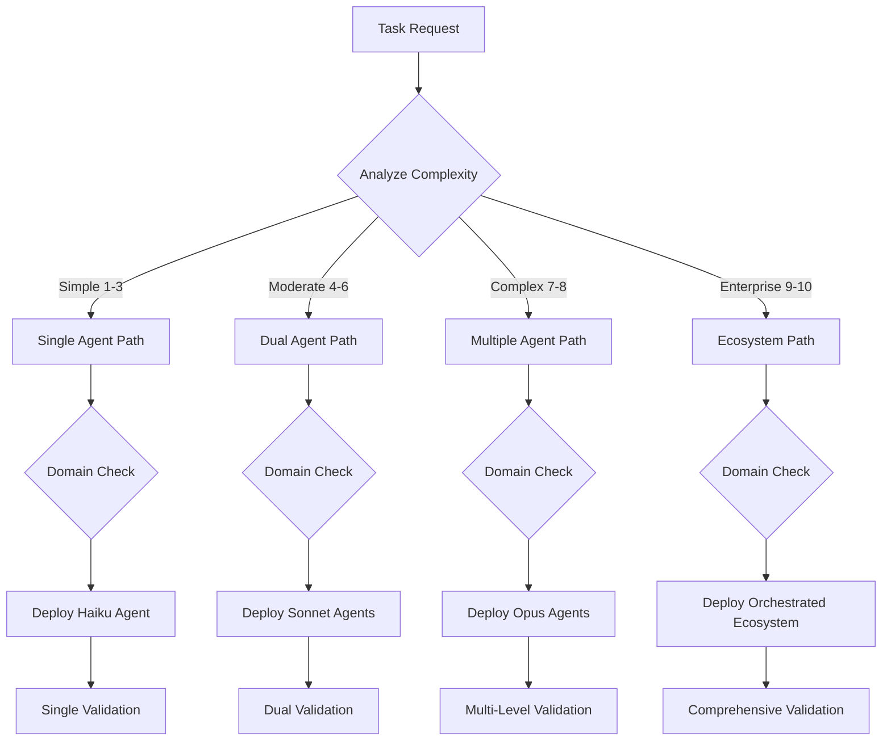

# Agent Deployment Selection Algorithm
## Intelligent Agent Matching for Maximum Effectiveness

*Version: 4.0 | Framework: Universal Operation Mode | Status: ACTIVE*

## Algorithm Overview

This document defines the systematic algorithm for selecting and deploying the optimal agent configuration for any given task. The algorithm ensures consistent, efficient agent deployment with maximum capability activation.

## Selection Decision Tree



## Core Selection Algorithm

### Step 1: Task Complexity Assessment

```python
def assess_task_complexity(task):
    """
    Evaluates task complexity on a 1-10 scale
    """
    complexity_factors = {
        'domain_count': count_domains(task),           # 1-3 domains
        'integration_points': count_integrations(task), # Number of systems
        'uncertainty_level': assess_uncertainty(task),  # Known vs unknown
        'stakeholder_impact': assess_impact(task),      # User vs system-wide
        'technical_depth': assess_depth(task),          # Surface vs deep
        'timeline_pressure': assess_urgency(task),      # Relaxed vs critical
        'quality_requirements': assess_quality(task),   # Basic vs stringent
        'innovation_needed': assess_innovation(task)    # Standard vs novel
    }
    
    base_score = calculate_base_score(complexity_factors)
    adjusted_score = apply_modifiers(base_score, task)
    
    return min(10, max(1, adjusted_score))
```

### Step 2: Domain Identification

```python
def identify_domains(task):
    """
    Maps task to relevant specialization domains
    """
    domain_keywords = {
        'technical': ['code', 'architecture', 'api', 'system', 'implementation'],
        'validation': ['test', 'verify', 'validate', 'check', 'ensure'],
        'documentation': ['document', 'write', 'explain', 'describe', 'readme'],
        'research': ['investigate', 'analyze', 'explore', 'discover', 'find'],
        'strategic': ['plan', 'strategy', 'roadmap', 'vision', 'future'],
        'integration': ['connect', 'integrate', 'combine', 'merge', 'unify'],
        'optimization': ['optimize', 'improve', 'enhance', 'accelerate', 'refine'],
        'security': ['secure', 'protect', 'authenticate', 'authorize', 'encrypt']
    }
    
    identified_domains = []
    task_lower = task.lower()
    
    for domain, keywords in domain_keywords.items():
        if any(keyword in task_lower for keyword in keywords):
            identified_domains.append(domain)
    
    return identified_domains if identified_domains else ['general']
```

### Step 3: Agent Selection Matrix

```python
def select_agents(complexity_score, domains):
    """
    Selects optimal agents based on complexity and domains
    """
    agent_matrix = {
        'simple': {
            'technical': ['code-validator'],
            'validation': ['testing-specialist'],
            'documentation': ['documentation-curator'],
            'research': ['research-specialist'],
            'general': ['general-purpose']
        },
        'moderate': {
            'technical': ['code-quality-specialist', 'testing-strategy-specialist'],
            'validation': ['evidence-validation-specialist', 'testing-specialist'],
            'documentation': ['documentation-curator', 'technical-writing-specialist'],
            'research': ['research-specialist', 'pattern-extraction-agent'],
            'strategic': ['strategic-operations-orchestrator', 'opportunity-analyst']
        },
        'complex': {
            'technical': ['system-architecture-specialist', 'api-design-specialist', 
                         'performance-optimizer'],
            'validation': ['evidence-validation-specialist', 'security-validator',
                          'compliance-specialist'],
            'documentation': ['documentation-curator', 'technical-writing-specialist',
                            'knowledge-curator-specialist'],
            'strategic': ['strategic-operations-orchestrator', 'framework-evolution-specialist',
                         'agent-opportunity-analyst']
        },
        'enterprise': {
            'orchestrator': ['strategic-operations-orchestrator'],
            'technical': ['system-architecture-specialist', 'infrastructure-specialist'],
            'validation': ['evidence-validation-specialist', 'compliance-specialist'],
            'strategic': ['framework-evolution-specialist', 'strategic-analyst'],
            'integration': ['integration-specialist', 'system-integration-specialist']
        }
    }
    
    complexity_category = categorize_complexity(complexity_score)
    selected_agents = []
    
    for domain in domains:
        if domain in agent_matrix[complexity_category]:
            selected_agents.extend(agent_matrix[complexity_category][domain])
    
    return deduplicate_agents(selected_agents)
```

### Step 4: Deployment Pattern Selection

```python
def select_deployment_pattern(agents, complexity_score):
    """
    Determines optimal deployment pattern
    """
    patterns = {
        'single': {
            'condition': len(agents) == 1,
            'pattern': 'single_sequential',
            'coordination': 'none'
        },
        'dual': {
            'condition': len(agents) == 2,
            'pattern': 'coordinated_dual',
            'coordination': 'minimal'
        },
        'parallel': {
            'condition': len(agents) <= 5 and complexity_score < 7,
            'pattern': 'independent_parallel',
            'coordination': 'sync_points'
        },
        'coordinated_parallel': {
            'condition': len(agents) <= 8 and complexity_score < 9,
            'pattern': 'coordinated_parallel',
            'coordination': 'moderate'
        },
        'orchestrated': {
            'condition': len(agents) > 8 or complexity_score >= 9,
            'pattern': 'orchestrated_ecosystem',
            'coordination': 'comprehensive'
        }
    }
    
    for pattern_name, pattern_config in patterns.items():
        if evaluate_condition(pattern_config['condition'], agents, complexity_score):
            return pattern_config
    
    return patterns['orchestrated']  # Default to most comprehensive
```

## Complexity Scoring Matrix

### Base Complexity Factors

| Factor | Weight | Score Range | Description |
|--------|--------|-------------|-------------|
| Domain Count | 2.0 | 1-4 | Number of specialization domains involved |
| Integration Points | 1.5 | 1-5 | Systems requiring integration |
| Uncertainty Level | 1.8 | 1-5 | Degree of unknown requirements |
| Stakeholder Impact | 1.3 | 1-4 | Breadth of impact on users/systems |
| Technical Depth | 1.7 | 1-5 | Level of technical sophistication |
| Timeline Pressure | 1.2 | 1-3 | Urgency of completion |
| Quality Requirements | 1.4 | 1-4 | Stringency of quality standards |
| Innovation Needed | 1.6 | 1-5 | Novelty of solution required |

### Complexity Categories

```yaml
complexity_categories:
  simple:
    score_range: 1-3
    characteristics:
      - Single domain focus
      - Clear requirements
      - Standard patterns applicable
      - Minimal integration
      - Low stakeholder impact
    
  moderate:
    score_range: 4-6
    characteristics:
      - 2-3 domain intersection
      - Some uncertainty present
      - Moderate integration needs
      - Multiple stakeholders affected
      - Quality validation required
    
  complex:
    score_range: 7-8
    characteristics:
      - Multi-domain coordination
      - Significant uncertainty
      - Complex integrations
      - System-wide impact
      - Stringent quality requirements
    
  enterprise:
    score_range: 9-10
    characteristics:
      - Cross-functional domains
      - High uncertainty/innovation
      - Enterprise integrations
      - Strategic impact
      - Mission-critical quality
```

## Agent Capability Matching

### Capability Requirements Matrix

```yaml
capability_matching:
  analysis_capabilities:
    required_for: [research, investigation, discovery]
    agents:
      primary: [research-specialist, pattern-extraction-agent]
      secondary: [documentation-curator, knowledge-curator]
    tools_needed: [Grep, Glob, Read, WebSearch]
    
  creation_capabilities:
    required_for: [implementation, building, generating]
    agents:
      primary: [code-quality-specialist, api-design-specialist]
      secondary: [testing-strategy-specialist, documentation-curator]
    tools_needed: [Edit, MultiEdit, Write, Bash]
    
  validation_capabilities:
    required_for: [testing, verification, quality]
    agents:
      primary: [evidence-validation-specialist, testing-specialist]
      secondary: [security-validator, compliance-specialist]
    tools_needed: [Bash, Grep, Read, TodoWrite]
    
  orchestration_capabilities:
    required_for: [coordination, management, strategy]
    agents:
      primary: [strategic-operations-orchestrator]
      secondary: [agent-coordination-specialist]
    tools_needed: [TodoWrite, Read, LS]
    
  optimization_capabilities:
    required_for: [performance, efficiency, improvement]
    agents:
      primary: [performance-optimizer, efficiency-analyst]
      secondary: [monitoring-specialist, metrics-analyst]
    tools_needed: [Bash, Grep, Read, WebFetch]
```

## Parallel Deployment Optimization

### Parallelization Decision Algorithm

```python
def optimize_parallel_deployment(agents, task_dependencies):
    """
    Optimizes agent deployment for parallel execution
    """
    dependency_graph = build_dependency_graph(agents, task_dependencies)
    
    parallel_groups = []
    current_group = []
    
    for agent in agents:
        if can_run_parallel(agent, current_group, dependency_graph):
            current_group.append(agent)
        else:
            if current_group:
                parallel_groups.append(current_group)
            current_group = [agent]
    
    if current_group:
        parallel_groups.append(current_group)
    
    return optimize_groups(parallel_groups)

def can_run_parallel(agent, group, dependencies):
    """
    Determines if agent can run in parallel with group
    """
    constraints = {
        'max_parallel': 10,  # Framework limit
        'resource_conflict': check_resource_conflicts(agent, group),
        'data_dependency': check_data_dependencies(agent, group, dependencies),
        'coordination_overhead': calculate_overhead(len(group) + 1)
    }
    
    return (len(group) < constraints['max_parallel'] and
            not constraints['resource_conflict'] and
            not constraints['data_dependency'] and
            constraints['coordination_overhead'] < 0.15)
```

### Parallel Execution Patterns

```yaml
parallel_patterns:
  independent_parallel:
    description: "Agents with zero interdependencies"
    max_agents: 10
    coordination_overhead: <5%
    sync_points: [start, end]
    examples:
      - [research-specialist, documentation-curator, security-validator]
      - [pattern-extraction, metrics-collection, log-analysis]
    
  phased_parallel:
    description: "Groups of parallel agents in sequence"
    max_per_phase: 6
    coordination_overhead: 10-15%
    sync_points: [phase_boundaries]
    examples:
      phase1: [requirements-analyst, risk-assessor]
      phase2: [architect, security-designer, api-designer]
      phase3: [developer, tester, documenter]
    
  coordinated_parallel:
    description: "Parallel with synchronization points"
    max_agents: 5
    coordination_overhead: 15-20%
    sync_points: [multiple_checkpoints]
    examples:
      - agents: [architect, developer, tester]
        sync_at: [design_review, implementation_checkpoint, validation]
```

## Model Selection Optimization

### Model Assignment Algorithm

```python
def optimize_model_selection(agent, task_complexity, resource_constraints):
    """
    Selects optimal model based on task needs and constraints
    """
    model_capabilities = {
        'haiku': {
            'complexity_range': (1, 3),
            'speed': 1.0,
            'cost': 1.0,
            'accuracy': 0.85,
            'suitable_for': ['validation', 'simple_transform', 'status_check']
        },
        'sonnet': {
            'complexity_range': (3, 7),
            'speed': 0.6,
            'cost': 3.0,
            'accuracy': 0.92,
            'suitable_for': ['implementation', 'analysis', 'documentation']
        },
        'opus': {
            'complexity_range': (6, 10),
            'speed': 0.3,
            'cost': 10.0,
            'accuracy': 0.98,
            'suitable_for': ['architecture', 'strategy', 'complex_reasoning']
        }
    }
    
    # Primary selection based on complexity
    suitable_models = [
        model for model, caps in model_capabilities.items()
        if caps['complexity_range'][0] <= task_complexity <= caps['complexity_range'][1]
    ]
    
    # Optimization based on constraints
    if resource_constraints['optimize_for'] == 'speed':
        return min(suitable_models, key=lambda m: model_capabilities[m]['speed'])
    elif resource_constraints['optimize_for'] == 'cost':
        return min(suitable_models, key=lambda m: model_capabilities[m]['cost'])
    else:  # optimize for quality
        return max(suitable_models, key=lambda m: model_capabilities[m]['accuracy'])
```

## Validation Level Selection

### Validation Requirements Matrix

```yaml
validation_levels:
  basic:
    complexity: 1-3
    requirements:
      - syntax_validation
      - basic_functionality
      - output_format_check
    agents: [testing-specialist]
    evidence: [test_output, validation_log]
    
  standard:
    complexity: 4-6
    requirements:
      - comprehensive_testing
      - integration_validation
      - performance_baseline
      - security_scan
    agents: [testing-specialist, security-validator]
    evidence: [test_suite_results, security_report, performance_metrics]
    
  comprehensive:
    complexity: 7-8
    requirements:
      - full_test_coverage
      - integration_suite
      - performance_optimization
      - security_audit
      - compliance_check
    agents: [testing-specialist, security-validator, compliance-specialist]
    evidence: [coverage_report, audit_trail, compliance_matrix]
    
  enterprise:
    complexity: 9-10
    requirements:
      - enterprise_validation_suite
      - cross_system_integration
      - performance_at_scale
      - comprehensive_security
      - regulatory_compliance
      - stakeholder_validation
    agents: [evidence-validation-orchestrator, testing-specialist, 
            security-validator, compliance-specialist]
    evidence: [full_validation_package, stakeholder_signoff, audit_documentation]
```

## Dynamic Optimization Features

### Adaptive Selection

```python
def adaptive_agent_selection(task, historical_performance):
    """
    Adapts selection based on historical performance
    """
    base_selection = select_agents(task)
    
    # Analyze historical performance
    performance_data = analyze_performance(historical_performance, task)
    
    # Adjust selection based on patterns
    if performance_data['success_rate'] < 0.9:
        # Add validation agents
        base_selection.append('evidence-validation-specialist')
    
    if performance_data['integration_issues'] > 0:
        # Add integration specialist
        base_selection.append('integration-specialist')
    
    if performance_data['performance_degradation']:
        # Add performance optimizer
        base_selection.append('performance-optimizer')
    
    return optimize_selection(base_selection)
```

### Resource-Aware Deployment

```python
def resource_aware_deployment(agents, available_resources):
    """
    Optimizes deployment based on available resources
    """
    resource_requirements = calculate_requirements(agents)
    
    if resource_requirements > available_resources:
        # Downgrade models where possible
        agents = downgrade_models(agents)
        
        # Serialize parallel execution if needed
        if still_exceeds_resources(agents, available_resources):
            agents = serialize_execution(agents)
    
    return agents
```

## Selection Algorithm Examples

### Example 1: Simple Code Review

```yaml
task: "Review and improve error handling in auth module"
complexity_assessment:
  score: 3
  domains: [technical, validation]
  
agent_selection:
  primary: code-quality-specialist (sonnet)
  secondary: testing-specialist (haiku)
  
deployment_pattern: coordinated_dual
validation_level: basic
```

### Example 2: System Architecture Design

```yaml
task: "Design microservices architecture for e-commerce platform"
complexity_assessment:
  score: 8
  domains: [technical, strategic, integration]
  
agent_selection:
  orchestrator: strategic-operations-orchestrator (opus)
  technical: 
    - system-architecture-specialist (opus)
    - api-design-specialist (sonnet)
  integration: integration-specialist (sonnet)
  validation: 
    - evidence-validation-specialist (sonnet)
    - security-validator (sonnet)
  
deployment_pattern: orchestrated_ecosystem
validation_level: comprehensive
```

### Example 3: Framework Enhancement

```yaml
task: "Enhance agent ecosystem with adaptive learning capabilities"
complexity_assessment:
  score: 10
  domains: [strategic, technical, research, integration]
  
agent_selection:
  orchestrator: strategic-operations-orchestrator (opus)
  strategic:
    - framework-evolution-specialist (opus)
    - agent-opportunity-analyst (opus)
  technical:
    - system-architecture-specialist (opus)
    - agent-template-architect (opus)
  research:
    - research-specialist (sonnet)
    - pattern-extraction-agent (sonnet)
  validation:
    - evidence-validation-orchestrator (opus)
    - framework-coherence-specialist (sonnet)
  
deployment_pattern: orchestrated_ecosystem
validation_level: enterprise
```

## Performance Metrics

### Selection Effectiveness Metrics

```yaml
metrics:
  selection_accuracy:
    measurement: successful_completions / total_deployments
    target: >95%
    optimization_trigger: <90%
    
  resource_efficiency:
    measurement: actual_resources / estimated_resources
    target: 0.8-1.2
    optimization_trigger: >1.5 or <0.5
    
  completion_time:
    measurement: actual_time / estimated_time
    target: 0.9-1.1
    optimization_trigger: >1.3
    
  quality_achievement:
    measurement: quality_score / target_quality
    target: >100%
    optimization_trigger: <95%
```

## Continuous Improvement

### Learning Integration

The selection algorithm continuously improves through:

1. **Pattern Recognition**: Identifying successful agent combinations
2. **Performance Analysis**: Tracking deployment effectiveness
3. **Feedback Integration**: Incorporating user and system feedback
4. **Algorithm Refinement**: Updating selection criteria based on learnings

### Optimization Cycle

```yaml
optimization_cycle:
  collect:
    - deployment_metrics
    - performance_data
    - user_feedback
    - system_logs
    
  analyze:
    - success_patterns
    - failure_modes
    - optimization_opportunities
    - resource_utilization
    
  improve:
    - update_selection_matrix
    - refine_complexity_scoring
    - optimize_parallelization
    - enhance_validation_levels
    
  validate:
    - test_improvements
    - measure_impact
    - verify_stability
    - confirm_enhancement
```

This algorithm ensures optimal agent selection and deployment for every task, maximizing effectiveness while minimizing resource usage and complexity.